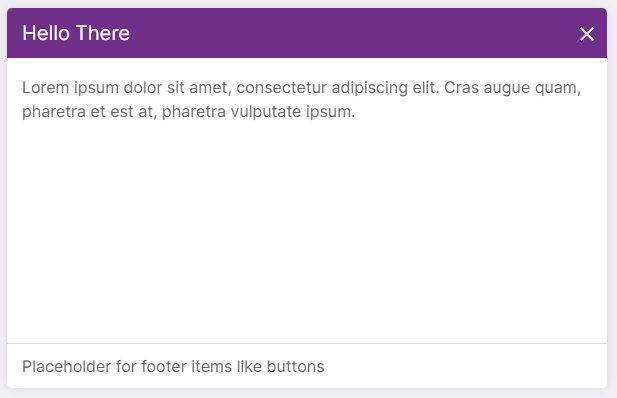

# Multi-purpose AlertBox React Component



This is an alert box component which has building blocks for making dialog boxes

- A display component (consume props and has no state).
- Compound component consisting of `Alert`, `Header`, `Body`, `Footer` sub-components.
- Uses 3rd-party `react draggable` library for draggable feature
- `Header`, `Body`, `Footer` are optional. Use them to leverage baked-in margins, paddings and layout properties.
- Consumer populates Header, Body and Footer with children components.

The box has 3 fixed sizes - `AlertBoxSize.SMALL`, `AlertBoxSize.MEDIUM`, `AlertBoxSize.LARGE`

## Props

| Prop                                 | Value                       | Description                                                                                                                                                                                                                                                                |
| :----------------------------------- | :-------------------------- | :------------------------------------------------------------------------------------------------------------------------------------------------------------------------------------------------------------------------------------------------------------------------- |
| size                                 | enum AlertBoxSize           | (optional) default - medium.                                                                                                                                                                                                                                               |
| draggable                            | boolean                     | (optional) default - false. Box is can be dragged by mouse if true.                                                                                                                                                                                                        |
| fixedPosition                        | enum AlertBoxFixedPositions | (optional) Currently, only supports `AlertBoxFixedPositions.CENTER`. This will float the box on center of screen. If not set, box will be relatively positioned to parent and other screen elements. This prop will be ignored if `draggable` or `defaultPosition` is set. |
| more props yet to document - todo... |                             |

### Usage

```
import React, { useState } from 'react';
import {
  AlertBox,
  AlertBoxFixedPositions,
  AlertBoxSize,
  FixedPositions
} from 'src/components/alertBox';

function Example() {
  const [showAlertBox, setShowAlertBox] = useState(false);

  function handleCloseIconClick() {
    setShowAlertBox(false);
  }

  useEffect(() => {
    setShowAlertBox(true);
  }, [])

  return <div style={{ width: '100vw', height: '100vh`, padding: '10px' }}>
    {showAlertBox ?
      <AlertBox
        size={AlertBoxSize.MEDIUM}
        fixedPosition={AlertBoxFixedPositions.CENTER}
        draggable
        defaultPosition={{x: 10, y: 10}}
        onCloseIconClick={handleCloseIconClick}>
        <AlertBox.Header heading="Hello" isDragHandle>There</AlertBox.Header>
        <AlertBox.Body hasFooter>
          <div>Lorem ipsum dolor sit amet, consectetur adipiscing elit. Cras augue quam, pharetra et est at, pharetra vulputate ipsum. </div>
        </AlertBox.Body>
        <AlertBox.Footer>
          <div>Placeholder for footer items like buttons</div>
        </AlertBox.Footer>
      </AlertBox> : null }
  </div>
}

```
