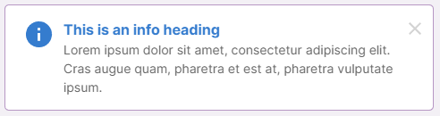
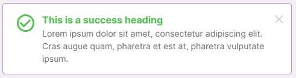

# StandardAlerts React Component





This is a basic alert message component.

- A display component (consume props and has no state).
- Composed using `AlertBox` component.

The width takes up 100% of the parent block elemet width. If you want to specify width, the recommended approach is to wrap the component in a `<div>` which has a width css property set. Another approach is to use the `style` prop.

The height is automatic based on content.

## Props

| Prop             |         Value         |                             Description                              |
| :--------------- | :-------------------: | :------------------------------------------------------------------: |
| alertType        |    enum AlertType     |  (Required) Sets the type of alert - error, warning, info, success   |
| disableCloseIcon |        boolean        |     (optional) default - false. Hides the 'X' close icon if tru      |
| headingText      |        string         |                   (optional) The bold text heading                   |
| style            | CSS Properties Object | (optional) CSS styles to override the alert container CSS properties |
| onCloseIconClick |       function        |     (optional) function that executes when close icon is clicked     |

### Usage

```
import React, { useState } from 'react';
import { AlertType, StandardAlert } from 'src/components/standardAlerts';

function Example() {
  const [showAlert, setShowAlert] = useState(false);

  function handleCloseIconClick() {
    setShowAlert(false);
  }

  useEffect(() => {
    setShowAlert(true);
  }, [])

  return <div style={{ width: '500px', padding: '10px' }}>
    {showAlert ?
      <StandardAlert
        alertType={AlertType.SUCCESS}
        headingText='This is a success heading'
        onCloseIconClick={handleCloseIconClick}>
        <div>Lorem ipsum dolor sit amet, consectetur adipiscing elit. Cras augue quam, pharetra et est at, pharetra vulputate ipsum. </div>
      </StandardAlert> : null }
  </div>
}

```
