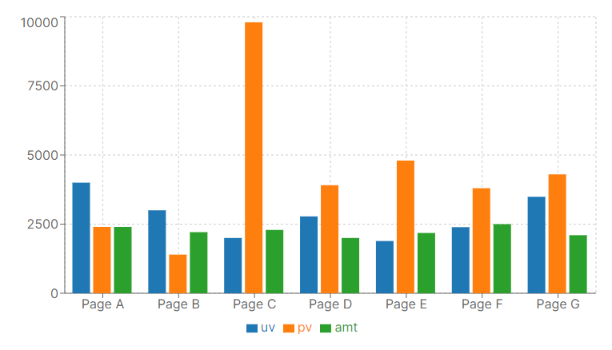
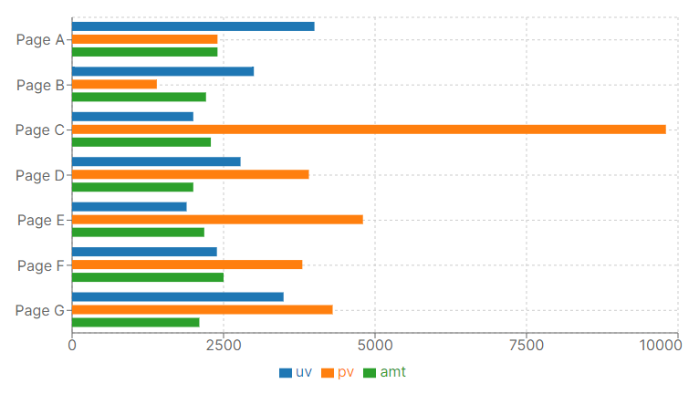
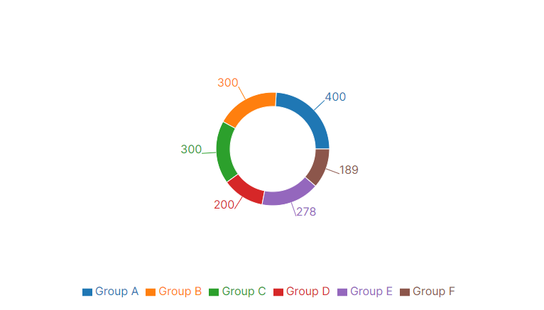

# AI Verify Shared Library - Charts

The AI Verify Shared Charts library is a wrapper around the [Recharts](https://recharts.org/en-US) library.

Chart components can be import from

    ai-verify-shared-library/charts

The following charts are available
* [BarChart](#barchart)
* [LineChart](#linechart)
* [AreaChart](#areachart)
* [PieChart](#piechart)
* [ScatterChart](#scatterchart)

## Chart Data Format
Chart data should be in format of array of objects.

Example data:
```
const data01 = [
  {
    name: 'Page A',
    uv: 4000,
    pv: 2400,
    amt: 2400,
  },
  {
    name: 'Page B',
    uv: 3000,
    pv: 1398,
    amt: 2210,
  },
  {
    name: 'Page C',
    uv: 2000,
    pv: 9800,
    amt: 2290,
  },
  {
    name: 'Page D',
    uv: 2780,
    pv: 3908,
    amt: 2000,
  },
  {
    name: 'Page E',
    uv: 1890,
    pv: 4800,
    amt: 2181,
  },
  {
    name: 'Page F',
    uv: 2390,
    pv: 3800,
    amt: 2500,
  },
  {
    name: 'Page G',
    uv: 3490,
    pv: 4300,
    amt: 2100,
  },
];

const data02 = [
  { name: 'Group A', value: 400 },
  { name: 'Group B', value: 300 },
  { name: 'Group C', value: 300 },
  { name: 'Group D', value: 200 },
  { name: 'Group E', value: 278 },
  { name: 'Group F', value: 189 },
];


const data03 = [
  { x: 100, y: 200 },
  { x: 120, y: 100 },
  { x: 170, y: 300 },
  { x: 140, y: 250 },
  { x: 150, y: 400 },
  { x: 110, y: 280 },
];
```

# BarChart
```
import { BarChart } from 'ai-verify-shared-library/charts'
```

## **BarChart** Properties

| Property | Type | Required | Description |
| -------- | ---- | -------- | ----------- |
| data | array of object | Yes | Source Data |
| xAxisDataKey | string | Yes | Key of data in the X Axis |
| bars | array of Bar object | Yes | Array of Bar definitions |
| chartProps | object | No | Override chart properties, see https://recharts.org/en-US/api/BarChart |
| xAxisProps | object | No | Override XAxis properties, see https://recharts.org/en-US/api/XAxis |
| yAxisProps | object | No | Override YAxis properties, see https://recharts.org/en-US/api/YAxis |
| legendProps | object | No | Override Legend properties, see https://recharts.org/en-US/api/Legend |
| hideLegend | boolean | No | If set to true, will not display the chart legend |

## **Bar** Properties
| Property | Type | Required | Description |
| -------- | ---- | -------- | ----------- |
| dataKey | string | Yes | Key of data for this bar |
| stackId | string | No | For stacked bars, When two or more bars has same value will be stacked in order | 
| fill | string | No | Color of bar in css hex code |
| legendType | 'line' \| 'plainline' \| 'square' \| 'rect' \| 'circle' \| 'cross' \| 'diamond' \| 'square' \| 'star' \| 'triangle' \| 'wye' \| 'none' | No | Type of icon in legend, defaults to 'none' |

## Examples

**Simple BarChart**


```
<BarChart
  data={data01}
  xAxisDataKey="name"
  bars={[{ dataKey:"uv" }, { dataKey:"pv" }, { dataKey:"amt" }]}
/>
```

**Vertical BarChart**


```
<BarChart
  data={data01}
  xAxisDataKey="name"
  chartProps={{ layout:"vertical" }}
  bars={[{ dataKey:"uv" }, { dataKey:"pv" }, { dataKey:"amt" }]}
/>
```

**Stacked BarChart**


```
<BarChart
  data={data01}
  xAxisDataKey="name"
  bars={[{ dataKey:"uv", stackId:"a" }, { dataKey:"pv", stackId:"a" }, { dataKey:"amt", stackId:"a" }]}
/>
```

# LineChart
```
import { LineChart } from 'ai-verify-shared-library/charts'
```

## **LineChart** Properties

| Property | Type | Required | Description |
| -------- | ---- | -------- | ----------- |
| data | array of object | Yes | Source Data |
| xAxisDataKey | string | Yes | Key of data in the X Axis |
| lines | array of Line object | Yes | Array of Line definitions |
| chartProps | object | No | Override chart properties, see https://recharts.org/en-US/api/LineChart |
| xAxisProps | object | No | Override XAxis properties, see https://recharts.org/en-US/api/XAxis |
| yAxisProps | object | No | Override YAxis properties, see https://recharts.org/en-US/api/YAxis |
| legendProps | object | No | Override Legend properties, see https://recharts.org/en-US/api/Legend |
| hideLegend | boolean | No | If set to true, will not display the chart legend |

## **Line** Properties

| Property | Type | Required | Description |
| -------- | ---- | -------- | ----------- |
| dataKey | string | Yes | Key of data for this line |
| fill | string | No | Color of line in css hex code |
| legendType | 'line' \| 'plainline' \| 'square' \| 'rect' \| 'circle' \| 'cross' \| 'diamond' \| 'square' \| 'star' \| 'triangle' \| 'wye' \| 'none' | No | Type of icon in legend, defaults to 'none' |

## Examples

**Simple LineChart**


```
<LineChart
  data={data01}
  xAxisDataKey="name"
  lines={[{ dataKey:"uv" }, { dataKey:"pv" }, { dataKey:"amt" }]}
/>
```

**Vertical LineChart**


```
<LineChart
  data={data01}
  xAxisDataKey="name"
  chartProps={{ layout:"vertical" }}
  lines={[{ dataKey:"uv" }, { dataKey:"pv" }, { dataKey:"amt" }]}
/>
```

# AreaChart
```
import { AreaChart } from 'ai-verify-shared-library/charts'
```

## **AreaChart** Properties

| Property | Type | Required | Description |
| -------- | ---- | -------- | ----------- |
| data | array of object | Yes | Source Data |
| xAxisDataKey | string | Yes | Key of data in the X Axis |
| areas | array of Bar object | Yes | Array of Area definitions |
| chartProps | object | No | Override chart properties, see https://recharts.org/en-US/api/AreaChart |
| xAxisProps | object | No | Override XAxis properties, see https://recharts.org/en-US/api/XAxis |
| yAxisProps | object | No | Override YAxis properties, see https://recharts.org/en-US/api/YAxis |
| legendProps | object | No | Override Legend properties, see https://recharts.org/en-US/api/Legend |
| hideLegend | boolean | No | If set to true, will not display the chart legend |

## **Area** Properties

| Property | Type | Required | Description |
| -------- | ---- | -------- | ----------- |
| dataKey | string | Yes | Key of data for this area |
| stackId | string | No | For stacked bars, When two or more bars has same value will be stacked in order | 
| fill | string | No | Color of area in css hex code |
| legendType | 'line' \| 'plainline' \| 'square' \| 'rect' \| 'circle' \| 'cross' \| 'diamond' \| 'square' \| 'star' \| 'triangle' \| 'wye' \| 'none' | No | Type of icon in legend, defaults to 'none' |

## Examples

**Simple AreaChart**


```
<AreaChart
  data={data01}
  xAxisDataKey="name"
  areas={[{ dataKey:"uv" }, { dataKey:"pv" }, { dataKey:"amt" }]}
/>
```

**Vertical AreaChart**


```
<AreaChart
  data={data01}
  xAxisDataKey="name"
  chartProps={{ layout:"vertical" }}
  areas={[{ dataKey:"uv" }, { dataKey:"pv" }, { dataKey:"amt" }]}
/>
```

# PieChart
```
import { PieChart } from 'ai-verify-shared-library/charts'
```

## Source Data
Each object in the source data must contain a "name" field to label each pie

## **PieChart** Properties

| Property | Type | Required | Description |
| -------- | ---- | -------- | ----------- |
| data | array of object | Yes | Source Data  |
| pies | array of Pie object | Yes | Array of Pie definitions |
| chartProps | object | No | Override chart properties, see https://recharts.org/en-US/api/LineChart |
| xAxisProps | object | No | Override XAxis properties, see https://recharts.org/en-US/api/XAxis |
| yAxisProps | object | No | Override YAxis properties, see https://recharts.org/en-US/api/YAxis |
| legendProps | object | No | Override Legend properties, see https://recharts.org/en-US/api/Legend |
| hideLegend | boolean | No | If set to true, will not display the chart legend |

## **Pie** Properties

| Property | Type | Required | Description |
| -------- | ---- | -------- | ----------- |
| dataKey | string | Yes | Key of data for this pie |
| fill | string | No | Color of pie in css hex code |
| legendType | 'line' \| 'plainline' \| 'square' \| 'rect' \| 'circle' \| 'cross' \| 'diamond' \| 'square' \| 'star' \| 'triangle' \| 'wye' \| 'none' | No | Type of icon in legend, defaults to 'none' |
| innerRadius | number | No | Inner radius of all the sectors in percentage |
| outerRadius | number | No | Inner radius of all the sectors in percentage |


## Examples

**Simple PieChart**


```
<PieChart
  pies={[{ dataKey:"value", data:data02  }]}
/>
```

**Donut Chart**

To render a donut chart, set the *innerRadius* and *outerRadius* properties


```
<PieChart
  pies={[{ dataKey:"value", data:data02, innerRadius:60, outerRadius:80  }]}
/>
```

The Charts library also exports a `renderCustomizedPieLabel` method that allows user to display the pie labels within the pie instead of outside. To use this method, import the method `renderCustomizedPieLabel` and set it to the `label` property.

```
import { PieChart, renderCustomizedPieLabel } from 'ai-verify-shared-library/charts'
```

Example customized label in a donut chart.

```
<PieChart
  pies={[{ dataKey:"value", data:data02, innerRadius:60, outerRadius:80, labelLine:false, label:renderCustomizedPieLabel }]}
/>
```


# ScatterChart
```
import { ScatterChart } from 'ai-verify-shared-library/charts'
```

## Source Data
Each object in the source data must contain a "x" and "y" fields.

## **ScatterChart** Properties

| Property | Type | Required | Description |
| -------- | ---- | -------- | ----------- |
| data | array of object | Yes | Source Data  |
| scatters | array of Scatter object | Yes | Array of Scatter definitions |
| chartProps | object | No | Override chart properties, see https://recharts.org/en-US/api/ScatterChart |
| xAxisProps | object | No | Override XAxis properties, see https://recharts.org/en-US/api/XAxis |
| yAxisProps | object | No | Override YAxis properties, see https://recharts.org/en-US/api/YAxis |

## **Scatter** Properties

| Property | Type | Required | Description |
| -------- | ---- | -------- | ----------- |
| dataKey | string | Yes | Key of data for this pie |
| fill | string | No | Color of pie in css hex code |
| legendType | 'line' \| 'plainline' \| 'square' \| 'rect' \| 'circle' \| 'cross' \| 'diamond' \| 'square' \| 'star' \| 'triangle' \| 'wye' \| 'none' | No | Type of icon in legend, defaults to 'none' |


## Examples

**Simple ScatterChart**


```
<ScatterChart
  scatters={[{ data:data03  }]}
/>
```
