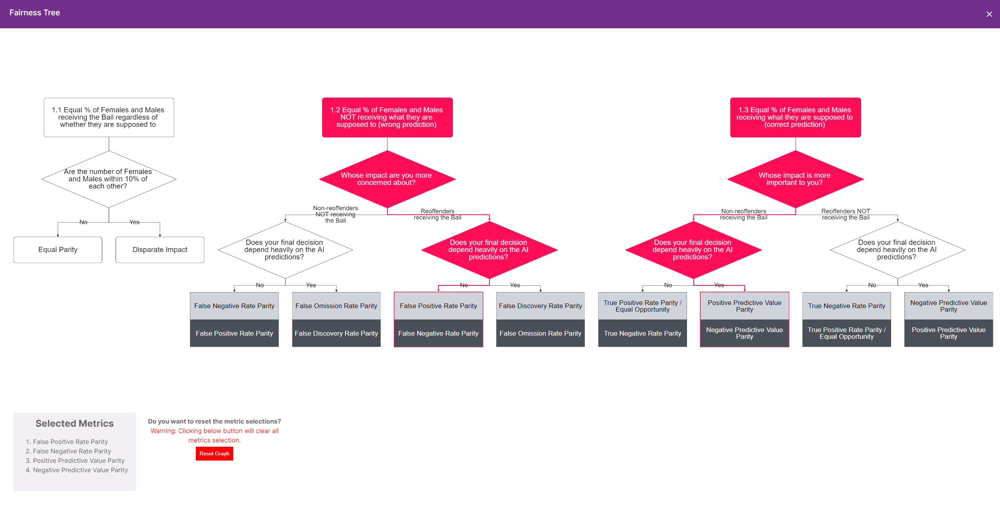
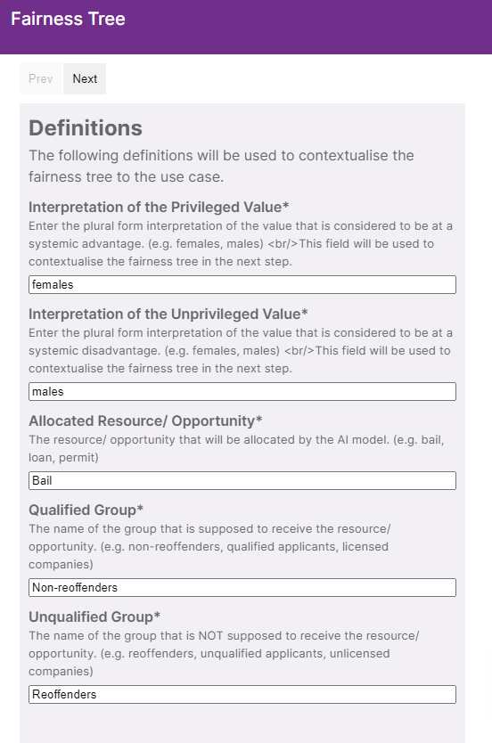

# AI Verify Decision Tree

The DecisionTree component allows user to build decisions trees which guides the user to select and rank relevant metrics, depending on their use case.



| Property | Type | Required | Description |
| -------- | ---- | -------- | ----------- |
| data | any | Yes | User data that is passed from component props |
| onChangeData | (key: string, value: any) => void | Yes | Function to update user data, passed from component props |
| graphdata | any | Yes | Defines the nodes and edges in the tree, See [Graph Data Scehema](#graph-data-schema) for the schema of the graph data |
| definitions | any[] | Yes | List of defitions that will be used to contextualize the decision tree by replacing substitution keys in the graph data **stext** field with the definition input value |

## Decision Tree Graph Data

The graphdata property defines the nodes and edges in the decision tree. This section describes the types of nodes and edges that should be defined.

Refer to [this section](#graph-data-schema) for the graph data schema.

### Type of Nodes

| Type | Description |
| ---- | ----------- |
| outcome | The root node of the branch of the decision that the user has to select |
| question | Prompt user to select a path from the outgoing edges |
| metric | The leaf node of the outcome branch that is a metric |
| metric2 | The leaf node of the outcome branch that separate metrics for positive and negative labels |

## Decision Tree Definitions

The definitions will be used to contextualise the fairness tree to the use case. 

When the decision tree is first loaded from the user input page, it will display the list of definitions that the user need to input before the graph is created. The decision tree graph will read in the definitions and use it to replace the keys in the stext fields in the decision tree with the value input by user. This allows developers to contextualize the texts in the decision tree based on use case, e.g. to build fairness tree.



## Example use of Decision Tree as Input Block

See [Example Graph Data](#example-graph-data) for example graph data.

See [Example Decision Tree Definition](#example-decision-tree-definition) for example graph data.

```
import { DecisionTree } from 'ai-verify-shared-library/graph';
import graphdata from './fairness-tree-graphdata.json';
import definitions from './fairness-tree-definitions.json';

<DecisionTree data={props.data} onChangeData={props.onChangeData} graphdata={graphdata} definitions={definitions} />
```

## Graph Data Schema

```
{
  "title": "AI Verify Decision Tree Graph Data Schema",
  "description": "AI Verify Decision Tree Graph Data Schema",
  "type": "object",
  "properties": {
    "nodes": {
      "type": "array",
      "minItems": 1,
      "items": {
        "description": "Graph nodes",
        "type": "object",
        "properties": {
          "data": {
            "type": "object",
            "properties": {
              "id": {
                "description": "Unique ID that identifies the node in the graph",
                "type": "string"
              },
              "type": {
                "description": "Type of node",
                "type": "string",
                "enum": [
                  "outcome",
                  "question",
                  "metric",
                  "metric2"
                ]
              },
              "text": {
                "description": "Text that will be displayed within the node",
                "type": "string"
              },
              "stext": {
                "description": "Template text that will be displayed as text with definition substitution",
                "type": "string"
              },
              "gqn": {
                "description": "List of questions that will be displayed and prompt user for input",
                "type": "array",
                "minItems": 1,
                "items": {
                  "type": "string"
                }
              },
              "text_positive": {
                "description": "Metric for positive labels",
                "type": "string"
              },
              "text_negative": {
                "description": "Metric for positive labels",
                "type": "string"
              }
            },
            "required": [
              "id",
              "type"
            ],
            "if": {
              "properties": {
                "type": {
                  "const": "metric2"
                }
              },
            },
            "then": {
              "required": [
                "text_negative",
                "text_positive"
              ]
            },
            "else": {
              "anyOf": [
                {
                  "required": [
                    "text"
                  ]
                },
                {
                  "required": [
                    "stext"
                  ]
                }
              ]
            },
            "allOf": [
              {
                "if": {
                  "properties": {
                    "type": {
                      "const": "outcome"
                    }
                  }
                },
                "then": {
                  "required": [
                    "gqn"
                  ]
                }
              },
              {
                "if": {
                  "properties": {
                    "type": {
                      "const": "question"
                    }
                  }
                },
                "then": {
                  "required": [
                    "gqn"
                  ]
                }
              }
            ]
          }
        },
        "required": [
          "data"
        ]
      }
    },
    "edges": {
      "description": "Graph edges",
      "type": "array",
      "minItems": 1,
      "items": {
        "type": "object",
        "properties": {
          "data": {
            "type": "object",
            "properties": {
              "id": {
                "description": "Unique ID that identifies the edge in the graph",
                "type": "string"
              },
              "source": {
                "description": "ID of source node",
                "type": "string"
              },
              "target": {
                "description": "ID of target node",
                "type": "string"
              },
              "text": {
                "description": "Text that will be displayed within the node",
                "type": "string"
              },
              "stext": {
                "description": "Template text that will be displayed as text with definition substitution",
                "type": "string"
              }
            },
            "required": [
              "id",
              "source",
              "target"
            ]
          }
        },
        "required": [
          "data"
        ]
      }
    }
  },
  "required": [
    "nodes"
  ]
}
```

### Example Graph Data
Save the following into a file "fairness-tree-graphdata.json"
```
{
	"nodes": [
		{ "data":{ "id": "n1.1", "type": "outcome",
			"stext": "1.1 Equal % of [privilege] and [unprivilege] receiving the [favourableOutcomeName] regardless of whether they are supposed to",
			"gqn": ["Are qualifications necessary for an individual to be given the [favourableOutcomeName]?","What are the negative implications if [unqualified] does not receive the [favourableOutcomeName]? Do they outweigh the necessity of giving the [favourableOutcomeName] based on qualifications?"]
		} },
		{ "data":{ "id": "n2", "type": "question",
			"stext": "Are the number of [privilege] and [unprivilege] within 10% of each other?",
			"gqn": ["What is the percentage difference of the group sizes?"]
		} },
		{ "data":{ "id": "n2.1", "type": "metric", "text": "Equal Parity" } },
		{ "data":{ "id": "n2.2", "type": "metric", "text": "Disparate Impact" } },
		{ "data":{ "id": "n1.2", "type": "outcome",
			"stext": "1.2 Equal % of [privilege] and [unprivilege] NOT receiving what they are supposed to (wrong prediction)",
			"gqn": ["What are the lost opportunities or harm inflicted on various parties such as the individual, society, and business, due to [qualified] not receiving the [favourableOutcomeName]?","What are the benefits of [unqualified] receiving the [favourableOutcomeName] and the resulting negative implications on the other parties, such as the society and business?"]
		} },
		{ "data":{ "id": "n3", "type": "question",
			"text": "Whose impact are you more concerned about?",
			"gqn": ["Weigh the benefit and harm of the various parties involved, such as individual, society, and business."]
		} },
		{ "data":{ "id": "n5.1", "type": "question",
			"text": "Does your final decision depend heavily on the AI predictions?",
			"gqn": ["Do the model's predictions have significant impact on the final decision? Human in-, over-, or out-of-the-loop?"]
		} },
		{ "data":{ "id": "n5.1.1", "type": "metric2", "text_positive": "False Negative Rate Parity", "text_negative": "False Positive Rate Parity" } },
		{ "data":{ "id": "n5.1.2", "type": "metric2", "text_positive": "False Omission Rate Parity", "text_negative": "False Discovery Rate Parity" } },
		{ "data":{ "id": "n5.2", "type": "question",
			"text": "Does your final decision depend heavily on the AI predictions?",
			"gqn": ["Do the model's predictions have significant impact on the final decision? Human in-, over-, or out-of-the-loop?"]
		} },
		{ "data":{ "id": "n5.2.1", "type": "metric2", "text_positive": "False Positive Rate Parity", "text_negative": "False Negative Rate Parity" } },
		{ "data":{ "id": "n5.2.2", "type": "metric2", "text_positive": "False Discovery Rate Parity", "text_negative": "False Omission Rate Parity" } },
		{ "data":{ "id": "n1.3", "type": "outcome",
			"stext": "1.3 Equal % of [privilege] and [unprivilege] receiving what they are supposed to (correct prediction)",
			"gqn": ["What are the factors that make giving [qualified] the [favourableOutcomeName] correctly crucial?",
				"What are the factors that make rejecting [unqualified] of the [favourableOutcomeName] correctly crucial? Consider the objectives or limiting factors faced by the business and the consequences of not receiving [favourableOutcomeName]."]
		} },
		{ "data":{ "id": "n4", "type": "question",
			"text": "Whose impact is more important to you?",
			"gqn": ["Weigh the benefit and harm of the various parties involved, such as individual, society, and business."]
		} },
		{ "data":{ "id": "n6.1", "type": "question",
			"text": "Does your final decision depend heavily on the AI predictions?",
			"gqn": ["Do the model's predictions have significant impact on the final decision? Human in-, over-, or out-of-the-loop?"]
		} },
		{ "data":{ "id": "n6.1.1", "type": "metric2", "text_positive": "True Positive Rate Parity / Equal Opportunity", "text_negative": "True Negative Rate Parity" } },
		{ "data":{ "id": "n6.1.2", "type": "metric2", "text_positive": "Positive Predictive Value Parity", "text_negative": "Negative Predictive Value Parity" } },
		{ "data":{ "id": "n6.2", "type": "question",
			"text": "Does your final decision depend heavily on the AI predictions?",
			"gqn": ["Do the model's predictions have significant impact on the final decision? Human in-, over-, or out-of-the-loop?"]
		} },
		{ "data":{ "id": "n6.2.1", "type": "metric2", "text_positive": "True Negative Rate Parity", "text_negative": "True Positive Rate Parity / Equal Opportunity" } },
		{ "data":{ "id": "n6.2.2", "type": "metric2", "text_positive": "Negative Predictive Value Parity", "text_negative": "Positive Predictive Value Parity" } }
	],
	"edges": [
		{ "data": { "id": "n1.1-n2", "source": "n1.1", "target": "n2" } },
		{ "data": { "id": "n2-n2.1", "source": "n2", "target": "n2.1","text": "No" } },
		{ "data": { "id": "n2-n2.2", "source": "n2", "target": "n2.2", "text": "Yes" } },
		{ "data": { "id": "n1.2-n3", "source": "n1.2", "target": "n3" } },
		{ "data": { "id": "n3-n5.1", "source": "n3", "target": "n5.1",
			"stext": "[qualified] NOT receiving the [favourableOutcomeName]"
		} },
		{ "data": { "id": "n5.1-n5.1.1", "source": "n5.1", "target": "n5.1.1", "text": "No" } },
		{ "data": { "id": "n5.1-n5.1.2", "source": "n5.1", "target": "n5.1.2", "text": "Yes" } },
		{ "data": { "id": "n3-n5.2", "source": "n3", "target": "n5.2",
			"stext": "[unqualified] receiving the [favourableOutcomeName]"
		} },
		{ "data": { "id": "n5.2-n5.2.1", "source": "n5.2", "target": "n5.2.1", "text": "No" } },
		{ "data": { "id": "n5.2-n5.2.2", "source": "n5.2", "target": "n5.2.2", "text": "Yes" } },
		{ "data": { "id": "n1.3-n4", "source": "n1.3", "target": "n4" } },
		{ "data": { "id": "n4-n6.1", "source": "n4", "target": "n6.1",
			"stext": "[qualified] receiving the [favourableOutcomeName]"
		} },
		{ "data": { "id": "n6.1-n6.1.1", "source": "n6.1", "target": "n6.1.1", "text": "No" } },
		{ "data": { "id": "n6.1-n6.1.2", "source": "n6.1", "target": "n6.1.2", "text": "Yes" } },
		{ "data": { "id": "n4-n6.2", "source": "n4", "target": "n6.2",
			"stext": "[unqualified] NOT receiving the [favourableOutcomeName]"
		} },
		{ "data": { "id": "n6.2-n6.2.1", "source": "n6.2", "target": "n6.2.1", "text": "No" } },
		{ "data": { "id": "n6.2-n6.2.2", "source": "n6.2", "target": "n6.2.2", "text": "Yes" } }
	]
}

```

## Decision Tree Definition Schema

```
{
  "title": "AI Verify Decision Tree Definition",
  "description": "Schema for the Decision Tree definitions, used for text substitution in the graph stext data",
  "type": "array",
  "items": {
    "type": "object",
    "properties": {
      "key": {
        "description": "Substitution key that will be used to search and replace with corresponding value in the decision graph data stext field. Substitution keys in the stext are denoted by [key]",
        "type": "string"
      },
      "name": {
        "description": "Name of the definition",
        "type": "string"
      },
      "description": {
        "description": "Describes the definition",
        "type": "string"
      }
    },
    "required": [
      "key",
      "name"
    ]
  }
}
```

### Example Decision Tree Definition

Save the following into a file "fairness-tree-definitions.json"

```
[
  {
    "key": "privilege",
    "name": "Interpretation of the Privileged Value",
    "description": "Enter the plural form interpretation of the value that is considered to be at a systemic advantage. (e.g. females, males) <br/>This field will be used to contextualise the fairness tree in the next step."
  },
  {
    "key": "unprivilege",
    "name": "Interpretation of the Unprivileged Value",
    "description": "Enter the plural form interpretation of the value that is considered to be at a systemic disadvantage. (e.g. females, males) <br/>This field will be used to contextualise the fairness tree in the next step."
  },
  {
    "key": "favourableOutcomeName",
    "name": "Allocated Resource/ Opportunity",
    "description": "The resource/ opportunity that will be allocated by the AI model. (e.g. bail, loan, permit)"
  },
  {
    "key": "qualified",
    "name": "Qualified Group",
    "description": "The name of the group that is supposed to receive the resource/ opportunity. (e.g. non-reoffenders, qualified applicants, licensed companies)"
  },
  {
    "key": "unqualified",
    "name": "Unqualified Group",
    "description": "The name of the group that is NOT supposed to receive the resource/ opportunity. (e.g. reoffenders, unqualified applicants, unlicensed companies)"
  }
]
```
