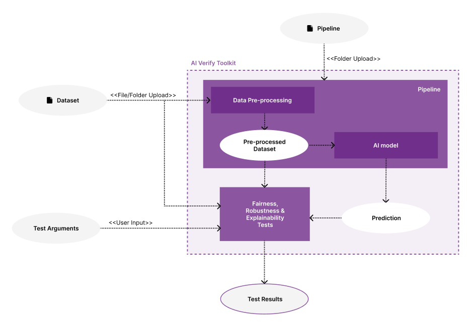

The AI Verify Toolkit supports two modes of accessing the AI models to be tested.

| Modes                   | Framework Libraries Supported                               | Dataset Type   |
| ----------------------- | ----------------------------------------------------------- | -------------- |
| Upload AI Model         | LightGBM, Scikit-learn, Tensorflow, XGBoost, Keras, PyTorch | Tabular Only   |
| Upload Pipline          | Scikit-learn pipeline, Keras, PyTorch                       | Tabular, image |
| Connect to AI Model API | Any AI Framework                                            | Tabular Only   |

The list of datatype formats supported are as follows:

| Dataset Type | Formats Supported                                                              |
| ------------ | ------------------------------------------------------------------------------ |
| Tabular      | Pandas, Delimiter-separated Values (comma, tab, semicolon, pipe, space, colon) |
| Image        | .jpeg, .jpg, .png                                                              |

## Upload AI Model

## Upload Pipeline

If your dataset requires pre-processing before being fed into the prediction model, you can upload the pre-processing functions together with your model as a pipeline folder.

Currently, the toolkit supports a limited set of models. Check out the[ full list of framework and algorithm types supported.](./supported-versions.md)