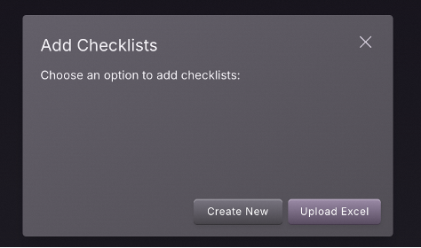
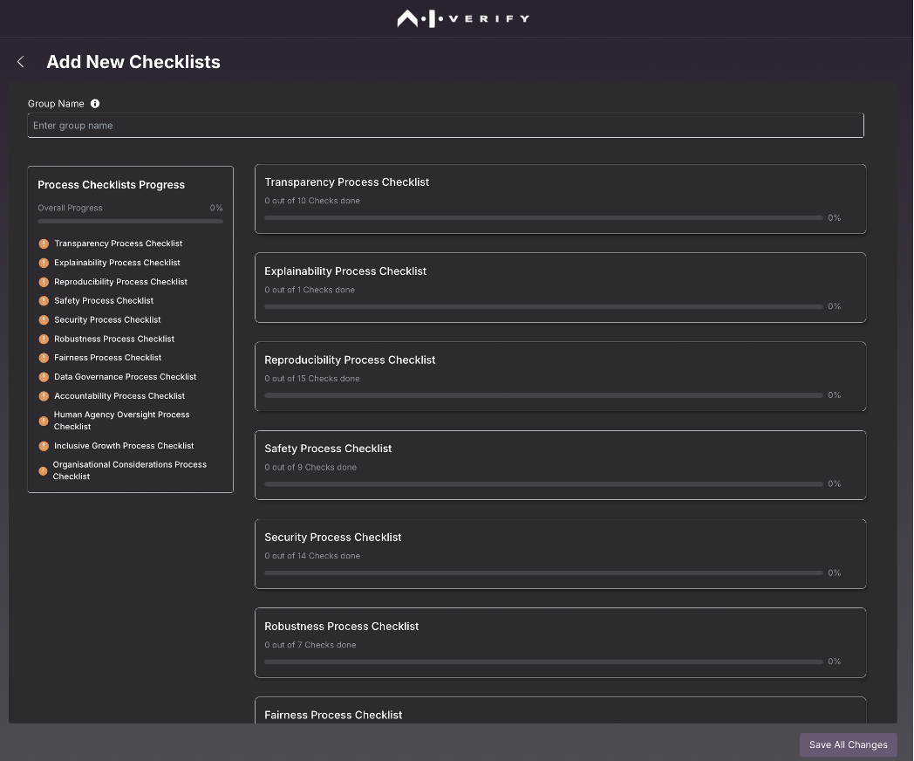
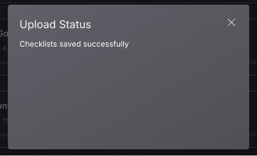

# AI Verify Process checklists

AI Verify Process check can be populated separately and re-used across multiple reports.
To create a process checklist, you can use Portal or upload Excel file.

From Homepage, click on "Manage".

Click on "User Inputs"

Click on "AI Verify Process Checklists"

Click on "Add Checklists"

Click on "Create New"

Fill in the checklist and click on "Save All Changes"

Provide a group name to the checklist and save it. Once this step is completed, you can use the name of the checklist and select it while generating the report.

