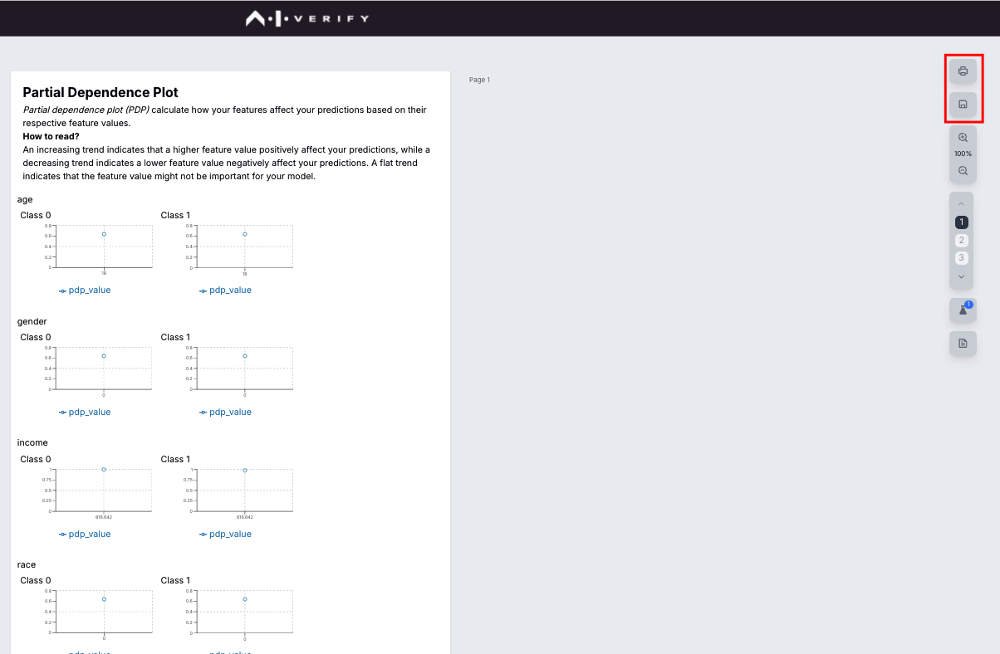

# Explainability Tests 

[Partial Dependence Plot](https://pypi.org/project/aiverify-partial-dependence-plot/) is a type of Explainability test. To execute this test against your model, you will need to [upload data and upload model](../getting-started.md) onto the portal. 

## Run using portal

Click on HomePage > Manage > Test Results > "Run New Test"


Choose the following options:

-	Algorithm: aiverify_partial_dependence_plot
-	Model: sample_bc_credit_sklearn_linear.LogisticRegression.sav
-	Test Dataset: sample_bc_credit_data.sav
-	Ground Truth Dataset: sample_bc_credit_data.sav
-	Ground Truth Column: default

Click on "Run Test"


You can confirm the status of the test run on the portal.


## Run using Command Line (CLI) interface

Install the test using pip:

```
pip install aiverify-partial-dependence-plot
```

Run the bash script to execute the plugin:

```
#!/bin/bash

root_path="<PATH_TO_FOLDER>/aiverify/stock-plugins/user_defined_files"
python -m aiverify_partial_dependence_plot \
  --data_path $root_path/data/sample_bc_credit_data.sav \
  --model_path $root_path/model/sample_bc_credit_sklearn_linear.LogisticRestression.sav \
  --ground_truth_path $root_path/data/sample_bc_credit_data.sav \
  --ground_truth default \
  --model_type REGRESSION \
  --no-run_pipeline
```

Once the algorithm runs successfully, the results will be saved in an `output` folder.
Use the generated result to create a report.


## Generate report

To generate report using the test results, select

HomePage > Create New Project  > Create New Report Template.


Select "Partial Dependence Plot" on the left pane and pick the 3 widgets and load them onto the canvas and click "Next".


Choose the model and test results from previous run and click "Next".




Save the report or export as a PDF.