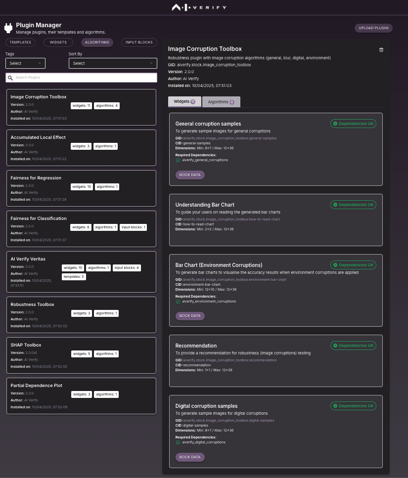

# Plugin Management

AI Verify Plugins are the modular building blocks that power AIVT 2.0. It is extensible and loaded dynamically. You could:
-	Add a custom widget to display result graphs on the report
-	Create new testing algorithms to enhance testing capabilities in AI Verify. You may choose to use third party plugin by direct download via pip install and upload them using Plugin Manager.

The Plugin Manager comes pre-loaded with 8 algorithms across Fairness, Explainability and Transparency. To open Plugin Manager, click on "Manage" in HomePage and select "Plugins".

There are 4 components of a plugin.

| Type of Component | Description |
|------------------|-------------|
| Template | Extend AI Verify with unique and reusable report templates |
| Widget | Extend AI Verify with new visualization for customized report |
| Algorithm | Extend AI Verify with new testing algorithm to run technical test on AI model |
| Input Block | Extend AI Verify with new requested parameters from the user |
| Algorithm | Extend AI Verify with new testing algorithm to run technical test on AI model |

Selecting a plugin, shows the algorithm and the corresponding widgets.

The algorithms will need to be executed and results will need to be saved before using them in the reports via widgets.

Refer to [detailed developer guide](https:/aiverify-foundation.github.io/aiverify-developer-tools/guided_example/introduction_to_plugins/) if you are interested in building your own plugin. 
