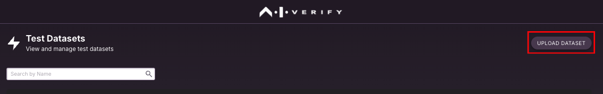
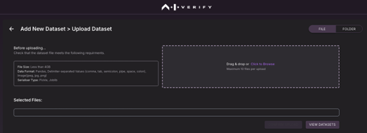
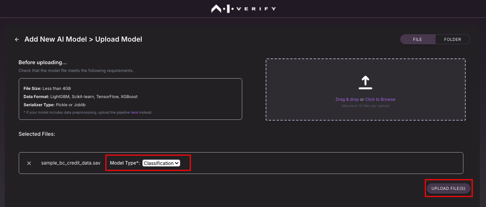
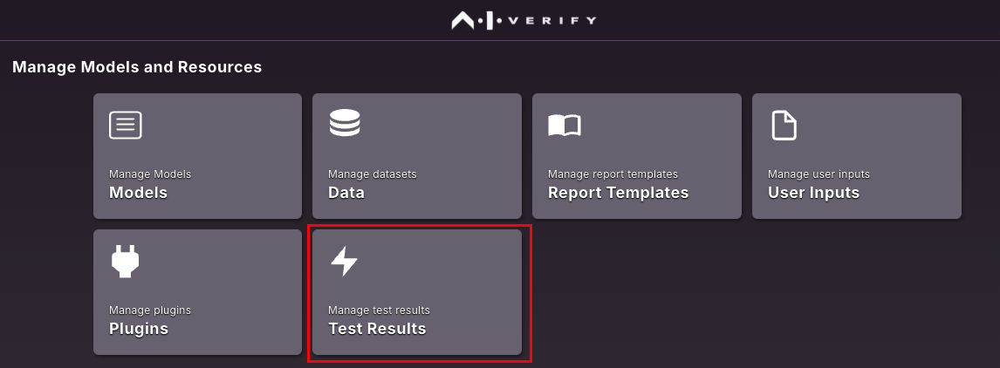
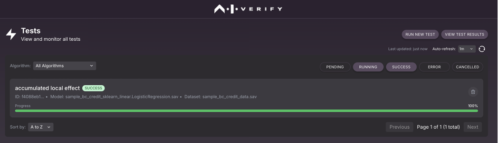
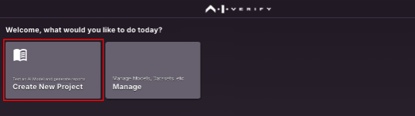
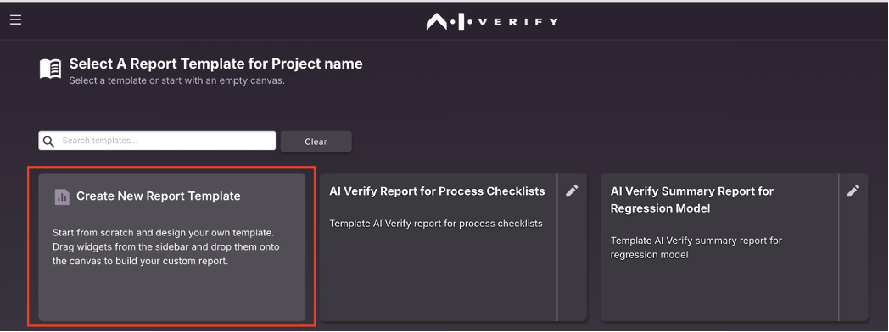
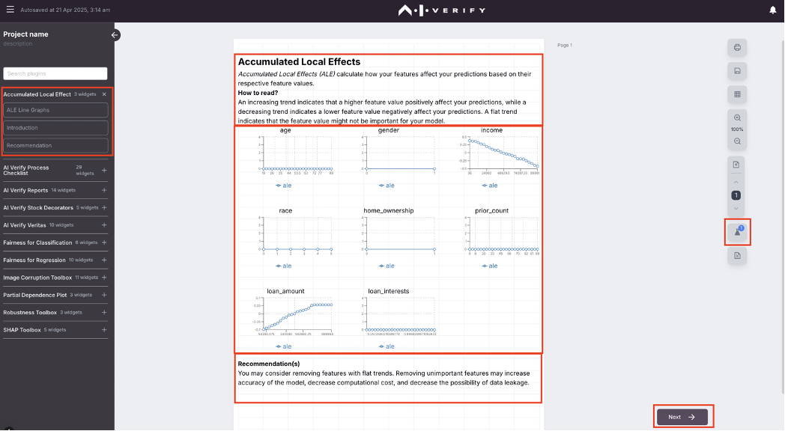
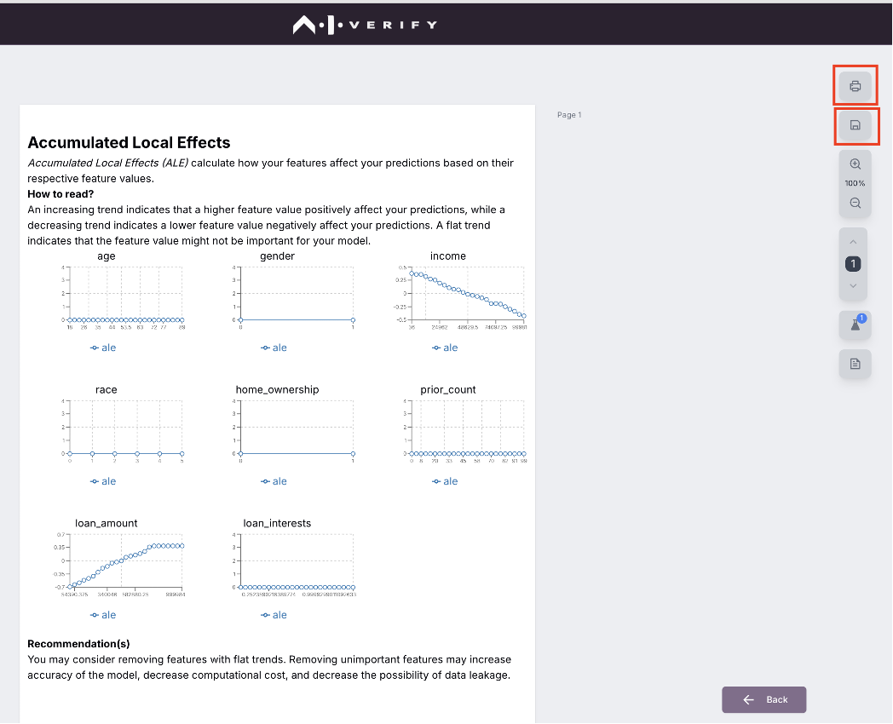

# Getting Started
For docker (recommended), follow installation steps from [Quick start guide](./quick-start-guide.md).

<object data="../res/AIVT_2.0_quick_start_guide.pdf" type="application/pdf" width="100%" height="350px">
  
Unable to display PDF, <a href="../res/AIVT_2.0_quick_start_guide.pdf">click here to download it</a>.

</object>

Refer to [detailed installation guide](./detailed-guide/installation-using-kubernetes.md) if you choose to use Kubernetes.

Open [http://localhost:3000](http://localhost:3000)

For generating reports, there are 4 steps needed:

1. Upload Dataset
2. Upload model
3. Run tests and save results
4. Generate report

##Upload Dataset

[Download `sample_bc_credit_data.sav` from this folder](https://github.com/aiverify-foundation/aiverify/tree/e2a0099bf51837e516ef09ca7115cbcbd5d8896c/stock-plugins/aiverify.stock.shap-toolbox/algorithms/shap_toolbox/tests/user_defined_files/data) to your local file system. To prepare data for your own use case [follow the detailed guide here](./detailed-guide/).

From Homepage, click on "Manage"

Click on "Data"

Click on "Upload Dataset"

Drag & Drop the dataset or choose from your local file system.

Click on “Confirm Dataset” to upload the dataset onto the portal.

##Upload model
[Download `sample_bc_credit_sklearn_linear.LogisticRegression.sav` from this folder](https://github.com/aiverify-foundation/aiverify/tree/e2a0099bf51837e516ef09ca7115cbcbd5d8896c/stock-plugins/aiverify.stock.shap-toolbox/algorithms/shap_toolbox/tests/user_defined_files/model) to your local file system. To prepare model for your own use case [follow the detailed guide here](./detailed-guide/)).

From Homepage, click on “Manage”

Click on "Models"

Click on "Upload Model"

Click on "Upload AI Model"”" – if you have one model file or choose "Upload Pipeline" to choose with data processing pipeline.

Choose the model file from local file system, select model type (Regression/Classification) based on your use case and click on "Upload File(s)"

You will receive a confirmation after model file is uploaded successfully onto the portal.

##Run tests and save results

If you want to run an "Explainability" test - example Accumulated Local Effects (ALE), 

From Homepage, click on “Manage”

Click on "Test Results"

Click on "Run New Tests"

Select 

-	Algorithm => aiverify_accumulated_local_effect
-	Model => sample_bc_credit_sklearn_linear.LogisticRegression.sav (saved in previous step)
-	Test Dataset => sample_bc_credit_data.sav (saved in previous step)

Click on "Run Test"

You will have the result of the test saved that can be used during report generation.

## Generate Report

Click on "Create New Project"

Fill in the project name, description, report title and company name.

Select "Create New Report Template"

Under "Accumulated Local Effects" section drag and drop the widgets into the canvas.

Note that this highlights a "Test" icon on the right – indicating the results of the test is needed for generating the report. Click "Next". 

Choose the model and test results saved earlier and click "Next".

This would generate a new report with selected sections.

You can either save this as a template or export as a PDF based on your needs.