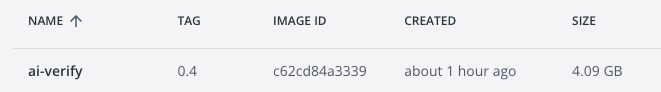

## System Recommended Requirements

To run AI Verify, these are the recommended requirements to run AI Verify on a local computer.

|                  | Recommended Requirements                                                                     |
| ---------------- | -------------------------------------------------------------------------------------------- |
| Operating System | Ubuntu 22.04 (64-bit)                                                                                 |
| Disk Space           | At least 10GB (excluding Docker Desktop)                                                                                |
| Memory           | At least 4GB                                                                                |

### Software Required
- [Docker Desktop](https://docs.docker.com/get-docker/)  

## Download and Run AI Verify

!!! Note
    If you have installed AI Verify before, it is recommended to start the container with a clean state. Run the following commands to clean up existing data and files: 
      ```bash
      bash docker-start.sh --reset
      ```

1. Launch Docker Desktop.

2. Download `setup-aiverify.zip` from [Github Release](https://github.com/IMDA-BTG/aiverify/releases/tag/v0.9.0).

3. Unzip `setup-aiverify.zip`.

4. Your folder structure should look like this.
```
<working directory>/
├── aiverify/
    ├── aiverify-dev
    └── aiverify-user
        ├── DockerFile
        ├── docker-compose.yml
        ├── docker-build.sh
        ├── docker-start.sh
        ├── docker-stop.sh
        └── ...
```

5. Open a terminal and change the directory to the folder location.
```bash
cd aiverify-user
```

6. Execute the following command to build AI Verify.
```bash
bash docker-build.sh
```

7. Click on the "Images" tab in Docker Desktop, you should see `ai-verify` running in Docker: 


!!! Warning
    It will take a while to build the docker image as there are many dependencies and modules required for the environment.   

## Run AI Verify

1. Start AI Verify using our start script. There might be a possibility that you might encounter this error if you are running this for the first time. If you do, execute the command again.
`Error response from daemon: failed to mkdir /var/lib/docker/volumes/aiverify-user_plugins-volume/_data/accumulated-local-effect/widgets: mkdir /var/lib/docker/volumes/aiverify-user_plugins-volume/_data/accumulated-local-effect/widgets: file exists`
```bash
bash docker-start.sh
```

2. Type [http://localhost:3000](http://localhost:3000) into your browser's address bar. 
!!! Warning
      Upon initial start-up of the toolkit, pages might take sometime to load.

   