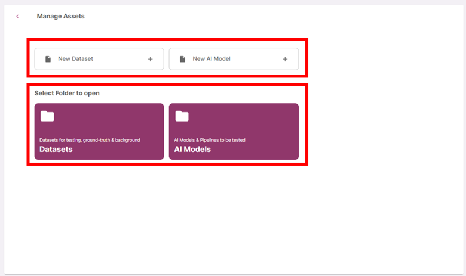
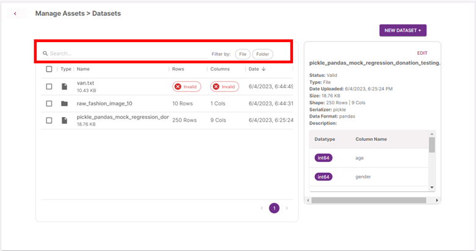
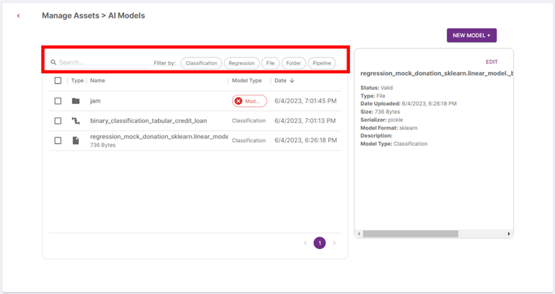
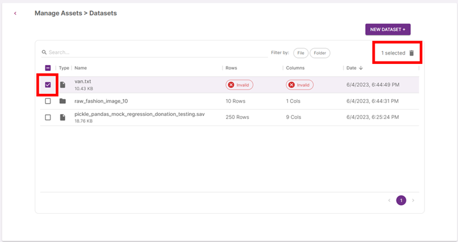

You can access the Models & Data management pages via the home page the menu icon at the header.

Assets in the toolkit are categorised into two main categories: Datasets and AI Models.

Datasets and Models uploaded onto the toolkit are stored in two different directories and subjected to different file validation processes.

In the assets page, click on ‘New Dataset +’ or ‘New AI Model +’ as shortcuts to the respective file upload pages or select one of the folders to view files previously uploaded.

### **Existing Assets**

The datasets page lists the files that have been uploaded as datasets and the models page lists the files that have been uploaded as models. Click on each row to view its file details.

#### **Filters**

You can search for files by its file name and sort the lists by clicking on each column header. You can also sort the files by these filters:

Dataset filters:

| Filter     | Description                              |
| ---------- | ---------------------------------------- |
| **File**   | Show datasets uploaded as a single file. |
| **Folder** | Show datasets uploaded as a folder.      |

Model filters:

| Filter             | Description                                                             |
| ------------------ | ----------------------------------------------------------------------- |
| **Classification** | how models where the user indicated ‘Classification’ as its model type. |
| **Regression**     | Show models where the user indicated ‘Regression’ as its model type.    |
| **File**           | Show models uploaded as a single file.                                  |
| **Folder**         | Show models uploaded as a folder.                                       |
| **Pipeline**       | Show models uploaded as a pipeline.                                     |

For each file uploaded onto the toolkit, the validation process extracts various details such as the model format, shape of the dataset, the serializer used, and the data’s column names. You can edit the name, description, and model type (for model files) by clicking on ‘Edit’. You will not be able to edit files that failed the validation process.

#### **Deletion**

To delete files uploaded, click on its checkbox then the delete icon.

<!-- TODO: Add new assets -->
