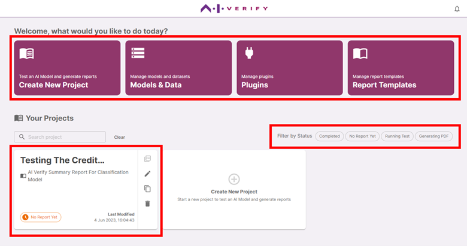

The home page provides you with direct navigation to all the essential functions of AI Verify:

- **Create New Project:** Workflow to create a new project to test an AI model and generate report.
- **Models & Data:** Management of assets (dataset and model files) uploaded onto the toolkit.
- **Plugins:** Management of plugins installed and installation of new plugins.
- **Report Templates:** Management of report templates created/installed and creation of new report templates.

On the home page, you will also be able to see the list of all projects you have created. Each project can be identified by its project name and the name of the report template used (if any).

###**Filters**

You can search for a project using the search box or the filters provided.

The filters categorise your projects based on the following statuses:

| Category       | Description                                                                                               |
| -------------- | --------------------------------------------------------------------------------------------------------- |
| Completed      | Your project has successfully completed all its tests to run, and a PDF of its report has been generated. |
| No Report Yet  | No reports have been generated for the project as no tests have been run.                                 |
| Running Test   | Tests for the project are currently being run.                                                            |
| Generating PDF | Tests (if any) for the project have completed running and a PDF report is currently being generated.      |

###**Project Actions**
| Icon | Action |
| -------------- | --------------------------------------------------------------------------------------------------------- |
|  | View generated PDF report. |
|  | Edit Project |
|  | Duplicate Project (Copy project to a new project) |
|  | Delete Project |
