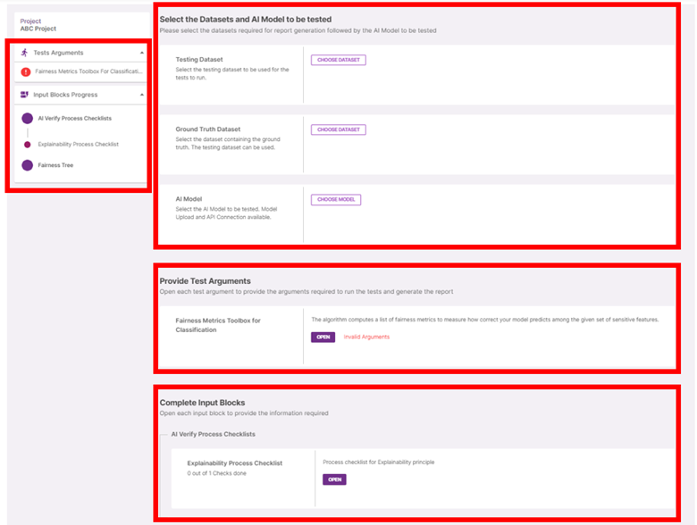

### **Progress**

Some reports can require many tests to run and user inputs. The ‘Tests Arguments’ and ‘Input Blocks Progress’ accordions on the left of the page helps you keep track of what is done and what isn’t. You can jump to focus on a particular input block by clicking on its name in the progress accordion.

### **File Selection**

Here is where you select the various files required. By clicking on ‘Choose dataset/model’ you can select from a list of previously uploaded files or upload a new file to be used.

### **Test Parameters & Input Blocks**

For each of the tests to run, click on ‘Open’ to open the dialog box to fill up its required test arguments.

For each of the input blocks required, click on ‘Open’ to open the dialog box to fill up its required inputs.
