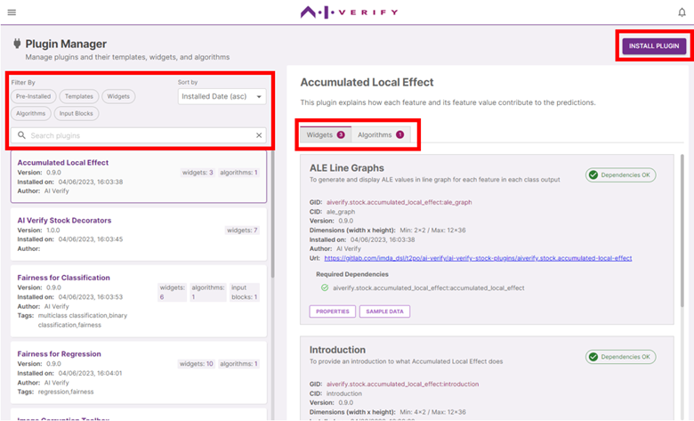

You can access the Plugin manager via the home page or the menu icon at the header.

#### **Search**

In the plugin manager page, you can view the list of plugins installed in your toolkit on the left panel. The toolkit comes with a set of pre-installed plugins, to view more details about these plugins, check out the Plugin Documentation here.
Using the search box, you can search for a plugin by:

- Name/ description of the plugin
- Name/ description of the plugin component
- Tags

#### **Filters**

You can sort the list of plugins by its name/ installed date, and filter the plugins shown using the following filters:

| Filter            | Description                                         |
| ----------------- | --------------------------------------------------- |
| **Pre-installed** | Show plugins that are pre-installed in the toolkit. |
| **Templates**     | Show plugins that contain report templates.         |
| **Widgets**       | Show plugins that contain report widgets.           |
| **Algorithms**    | Show plugins that contain testing algorithms.       |
| **Input Blocks**  | Show plugins that contain input blocks.             |

The contents of each plugin are categorised into Widgets, Algorithms, Input Blocks, and Templates. Under each plugin, click on the respective tabs to view its components.

#### **Required dependencies and packages**

Algorithm-type components come with a list of software packages you will need to have in your machine to run tests using that algorithm. The toolkit does a scan of the packages you have installed in your machine, and checks for its compatibility with the required packages. You are advised to update/install all of the required packages.

#### **Installing and Updating plugins**

Plugins for AI Verify are distributed as zip files. To update a plugin to a newer version, you can simply install the plugin again. To install a plugin, click on ‘Install’ and select the zip file.
