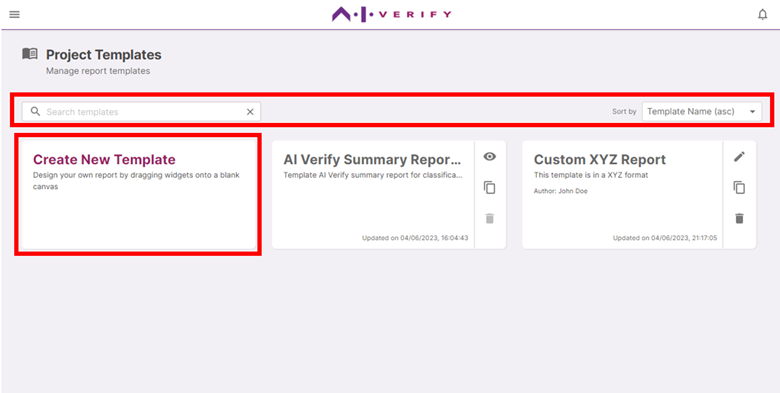

You can access the report template manager via the home page or the menu icon at the header.

The report template manager page lists the templates you have installed in the toolkit and any templates that you have created.

Each template is identified by its name, description, and author. You can search for a template using the search bar, and sort the list according to their names.

To create a new template, click on ‘Create New Template’

#### **Template actions**

For each template, there are template actions available:

| Icon                                                                   | Action                                                               |
| ---------------------------------------------------------------------- | -------------------------------------------------------------------- |
|          | Edit template.                                                       |
|      | Duplicate template. (Copy template to a new instance)                |
|  | Delete template.\* (Projects using the template will not be deleted) |

_\*Templates that are installed as part of plugins cannot be deleted._
