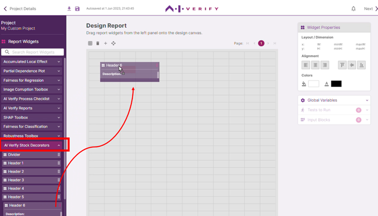

In this Canvas page, you can design and preview how the report to be generated will look like. In the Report Widgets panel, expand each accordion to explore the report widgets installed. To add the widget to your report, drag and drop it onto the canvas. You can drag to move the widgets anywhere within the page and adjust its dimensions.

AI Verify comes with a set of decorator widgets under the plugin ‘AI Verify Stock Decorators’. Let’s try out the ‘Header 6’ widget by dragging it onto the canvas.

To edit the widget, click on the widget on the canvas to highlight it, then click on its edit icon at the top right corner to open the Widget Content editor.

The ‘Header 6’ widget contains:

| Field     | Description                                                                                              |
| --------- | -------------------------------------------------------------------------------------------------------- |
| **Title** | Fill up this field to allow the widget to populate the canvas with text styled as ‘Header 6’.            |
| **Text**  | Fill up this field to allow the widget to populate the canvas with unstyled text below the styled Title. |

Click 'Ok' when done.

