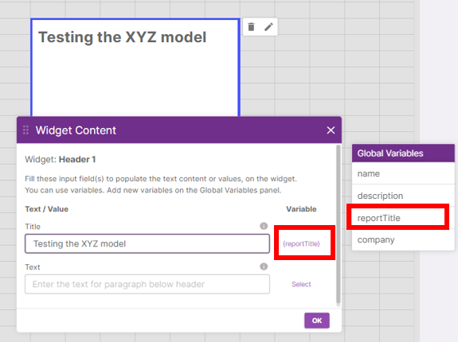
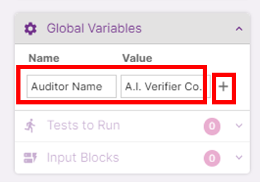
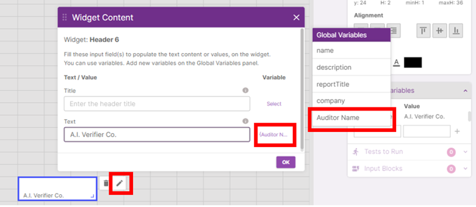

The project details you previously filled are saved as global variables and can be used as widget content. To use any of the global variables as the widget content, click on **‘Variable’** and select the fields available.

You can also set custom global variables by clicking on the **‘Global Variables’** accordion.

Fill up the following fields and click on **‘+’** to create the custom global variable:

| Field     | Description                                                                                |
| --------- | ------------------------------------------------------------------------------------------ |
| **Name**  | This is the name to identify the global variable by.                                       |
| **Value** | This is the value to be used when this global variable is selected to be used in a widget. |

Edit a widget and select the Name of the global variable you just created to automatically substitute the widget content field with its value.

