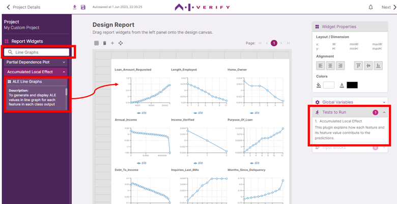
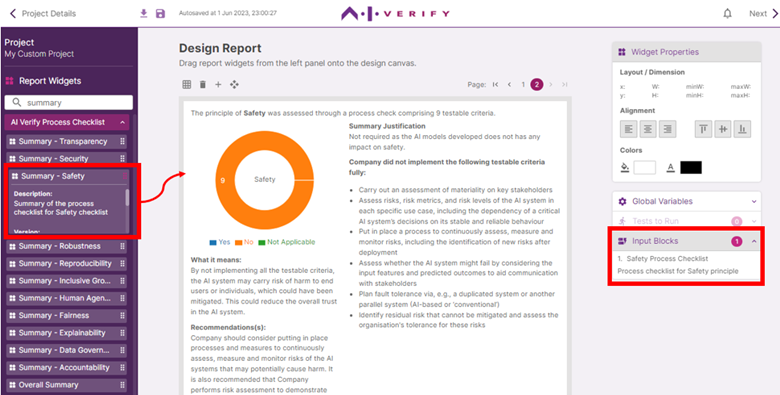

Some widgets have dependencies on tests to run.

Let’s include the ‘ALE Line Graphs’ widget. (You can search for it using the handy search bar in the Report Widgets accordion) This widget is dependent on test results from the Accumulated Local Effect test, and by including it in your report canvas, there is now 1 test to be run.

Some widgets have dependencies on additional user inputs.

Let’s include the ‘Summary - Safety’ widget. (You can search for it using the handy search bar in the Report Widgets accordion) This widget is dependent on user input from the Safety Process Checklist, and by including it in your report canvas, there is now 1 Input Block to be filled.

