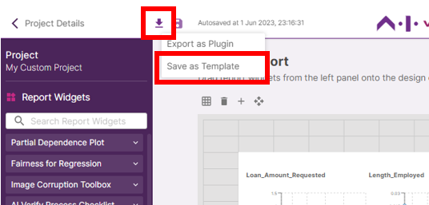
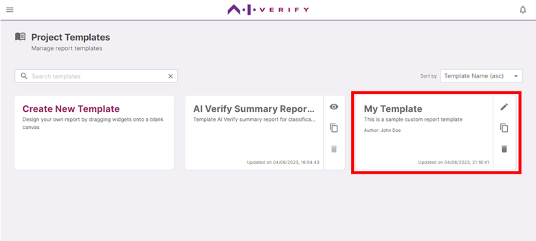

When you are satisfied with your report canvas, you can save it as a report template locally so that you can use it for future projects. Click on the download icon, then **'Save as Template’**.

The template detail fields are automatically generated from the project details, but you can edit them. Click **‘Save’** to save the report template.

Click **'Ok'**.

The report canvas you just designed is now available as a report template on your AI Verify Toolkit. You can further edit it in the future from the Report Templates Page.

