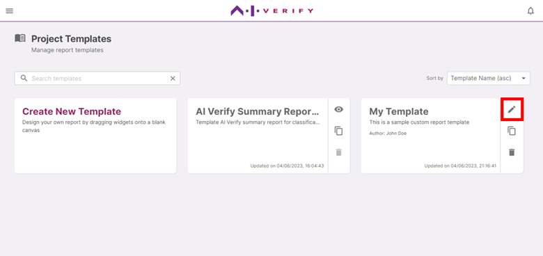

To share a report template with other users, you can export it as a plugin by clicking on the **edit button** to enter the report template canvas screen.

Click **'Export as Plugin'**.

The **Plugin GID** and **Template CID** fields are automatically generated, but you can edit it to any unique ID that would help you better identify the plugin.

Click on **‘Export’** to download the plugin .zip file.

