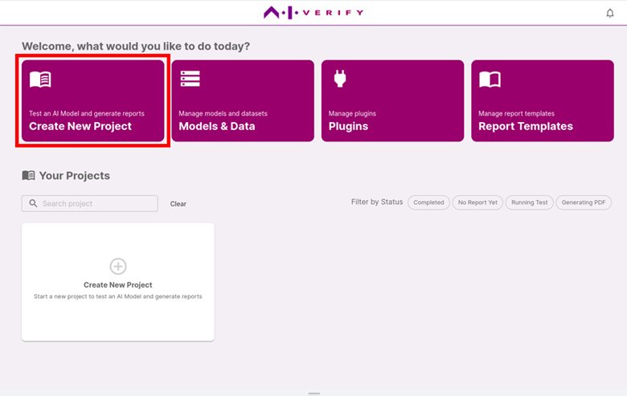
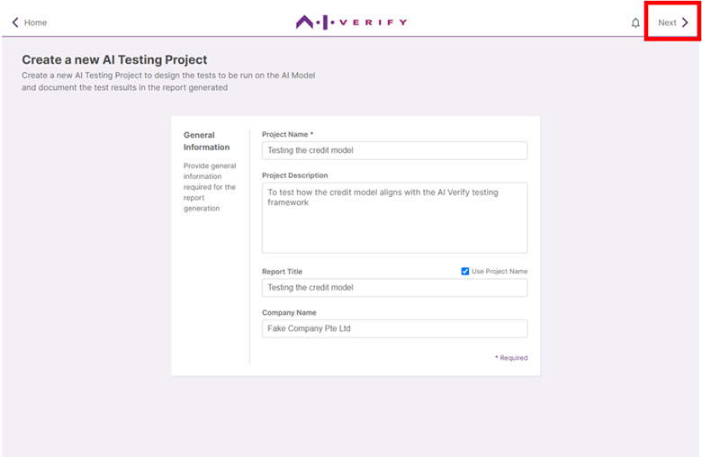

On the homepage, click on **'Create New Project'**

Provide the general information as shown in the table below:

| Field                       | Description                                                                                                                                                                                 | Value |
| --------------------------- | ------------------------------------------------------------------------------------------------------------------------------------------------------------------------------------------- |--- |
| **(required) Project Name** | To identify this project in the home page                                                                                         | Testing the credit model |
| **Project Description**     | To describe the scope and objective of this project _E.g. To test whether the XYZ classification model is fair towards all gender groups._ | To test how the credit model aligns with the AI Verify Testing Framework |
| **Report Title**            | To define the title of the report to be generated. Check ‘Use Project Name’ to automatically use the project name as the report title.                                   | Testing the credit model |
| **Company Name**            | To fill the name of the company that owns the AI model being tested.   This field is required if you are using the AI Verify Report Template.                                             | Fake Company Pte Ltd |

You will also be able to use the values entered in these fields in other parts of the report if desired. (See [‘How to design a customised report > Using Global Variables’](../../design-customized-report/4-using-global-variable/) )

Click **'Next'** to proceed.

