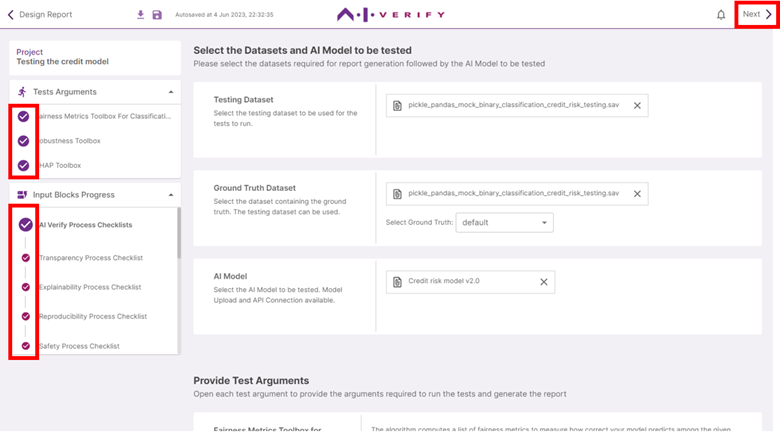
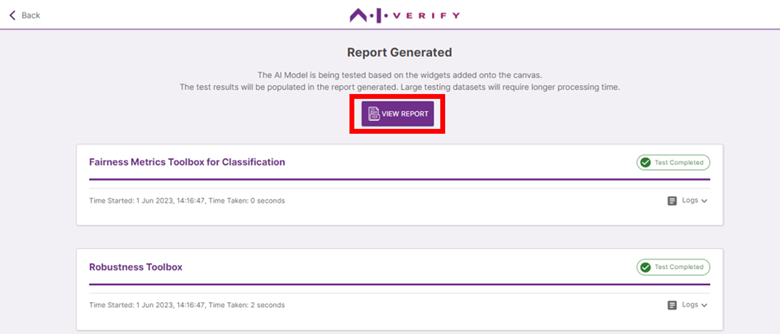

Before proceeding to run the tests and generate the report, you can check for the completion of required test arguments and process checks under ‘Test Arguments’ and ‘Input Blocks Progress’ accordion. The widgets in the _AI Verify Summary Report Template for Classification Models_ does not allow for report generation if any of the required components are incomplete.

Once verified that all test arguments and process checks are completed, click on **‘Next’**.

Click **'Proceed'**.

Now, sit back and watch as the AI Verify Test Engine does its magic!

Once the tests completed running, view PDF report generated by clicking on **‘View Report’**.

