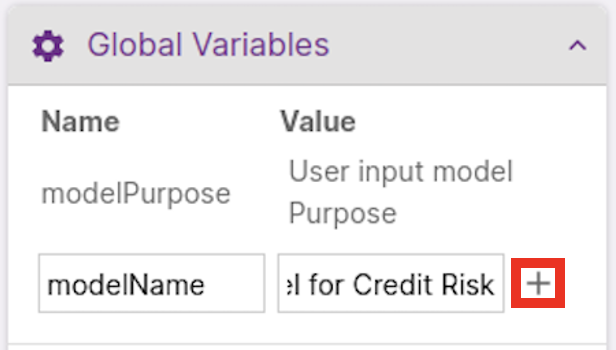
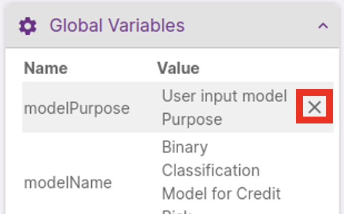
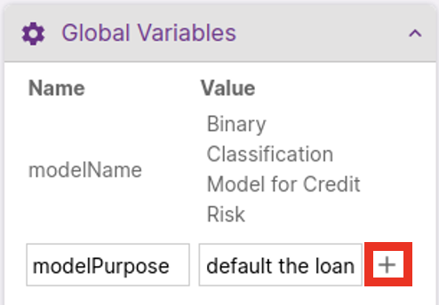
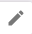
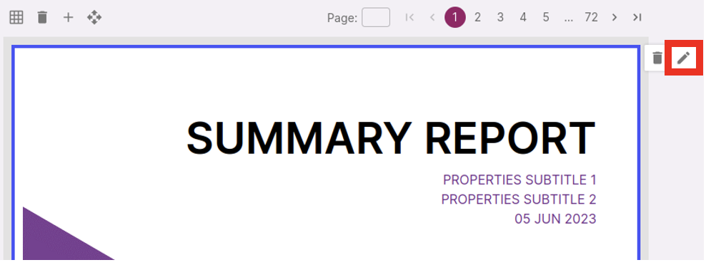
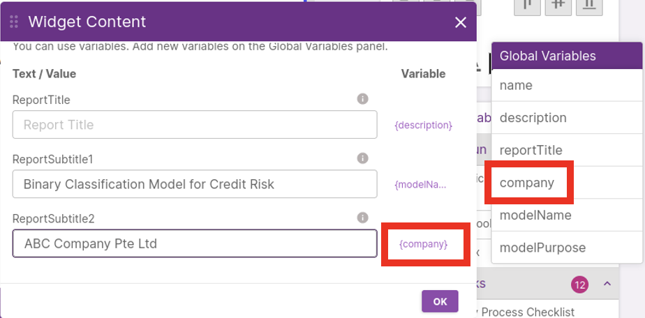
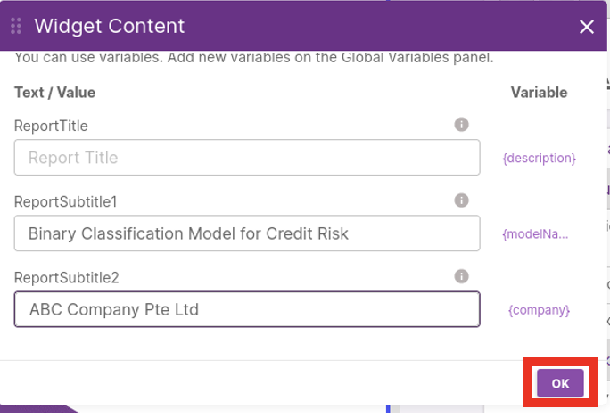

In this Canvas page, you can design and preview how the report to be generated will look like. Since the _AI Verify Summary Report Template for Classification Models_ is used for this project, the canvas is already populated with report components (widgets) that will help you obtain a report that aligns with the AI Verify Testing Framework.

To include the *Model Name* and *Company Name* in the cover page, we will be using global variables.The project details you previously filled are saved as global variables and can be used as widget content.

Click **'v'** to expand Global Variable.

Click **'x'** to remove modelName.

Enter 'modelName' for the **Name** field and a descriptive name of the AI model for the **Value** field.

Click **'x'** to remove modelPurpose.

Enter 'modelPurpose' for the **Name** field and a description of the AI model for the **Value** field.

Click on the cover page widget and click on the 
 **Edit** Icon

Select 'modelName' as the variable for **ReportSubtitle1** 

 Select 'company' as the variable for **ReportSubtitle2**

Click **'Ok'** to proceed.

Your cover page should look like this

Click **'Next'** on the top right corner of the screen to proceed to the next step.

