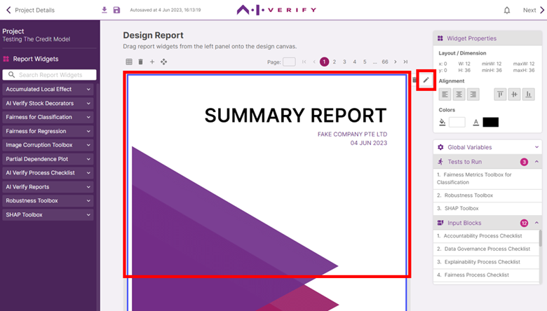
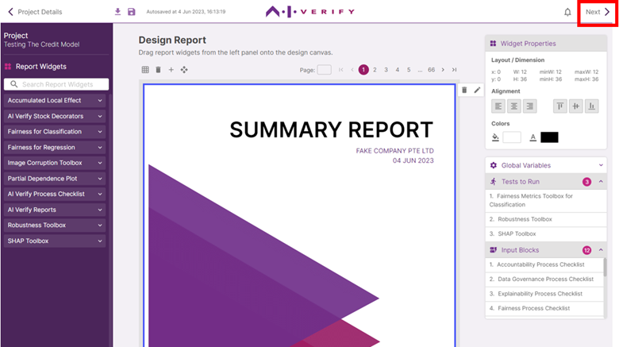

In this Canvas page, you can design and preview how the report to be generated will look like. Since the _AI Verify Summary Report Template for Classification Models_ is used for this project, the canvas is already populated with report components (widgets) that will help you obtain a report that aligns with the AI Verify Testing Framework.

To edit the *Report Title* and *Company Name*, click on the cover page widget on Page 1 and the edit icon at the top right corner of the outlined widget to open the *Widget Content* editor.

To navigate through the report pages, click on the page numbers or enter the page number to navigate to a specific page.

In this tutorial, we will not be adding or removing any widgets from the canvas.

Click 'Next' to proceed to the Input Blocks page.

