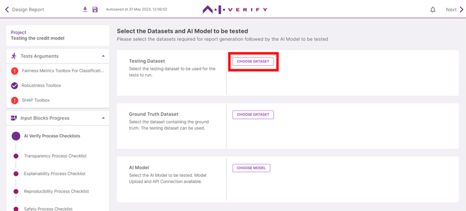
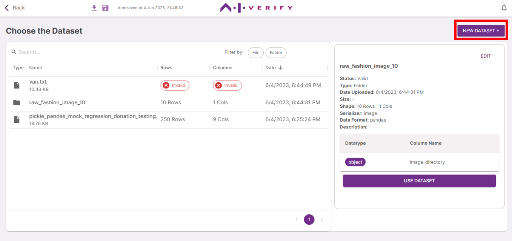

The AI Verify Report Template includes components that require technical tests to be run. To run these tests, you will need to upload the *Testing Dataset*, *Ground Truth Dataset*, and *AI Model*.

** Click on ‘Choose Dataset’.**

If you have previously uploaded the dataset to be used, click on the row of the dataset to be used. Note that datasets marked ‘Invalid’ have invalid properties and cannot be used. 

Click on **‘Use Dataset’** and [Skip to Step 5.](../5-select-ground-truth-dataset)

To upload new datasets, click on **‘New Dataset +’.**

Drag and drop the dataset file(s) onto the drop box or click to select files. A maximum of 10 files can be uploaded at once. You should also take the chance to upload the Ground Truth and Background Datasets as well. For image datasets, you can upload a folder containing the image files by clicking on ‘Upload Folder’ to select the folder to be uploaded. For more information on dataset preparation, (See Getting Started > Preparation of Input Files)

Click **‘Upload Selected Files >’**.

Once dataset validation is completed, you can view the dataset information on the right panel. If the dataset is valid, you can edit the dataset name and description by clicking on **‘Edit’**. If the dataset is invalid, refer to the error message for more information.

 Click on **‘Back to all datasets’**.

Select the *Testing Dataset* to be used by clicking on its row, then **‘Use Dataset’**.

