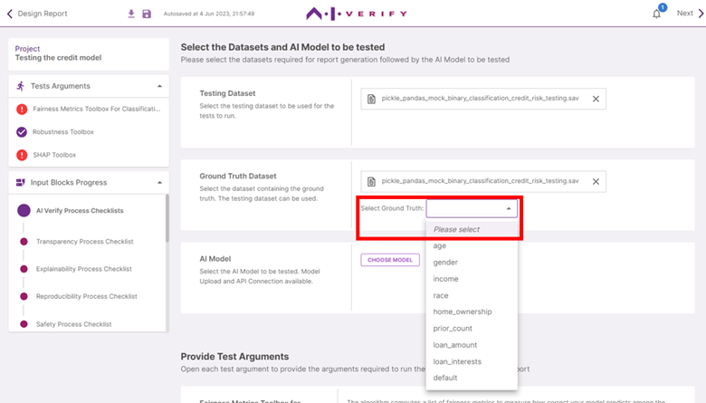

Click on ‘**Choose Dataset**’. 

Click on the row to select the dataset to be used as ground truth. The testing dataset can be used if it contains the ground truth. 
For this tutorial, we will be using the sample dataset `sample_bc_credit_data.sav`

Click on **‘Use Dataset’**.

Click on the **dropdown**. Select **"default"** as the ground truth column.

