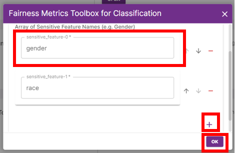
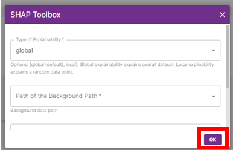
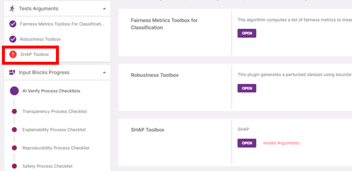

The _AI Verify Summary Report Template for Classification Models_ requires **Fairness** (Fairness Metrics Toolbox for Classification), **Robustness** (Robustness Toolbox) and **Explainability** (SHAP Toolbox) tests to be run. These tests require configuration of some test arguments in addition to the Datasets and AI Model files uploaded. For more information on these tests [(see References > List of AI Verify Plugins)](https://imda-btg.github.io/aiverify-developer-tools/stock_plugins/).

### Fairness Metrics Toolbox for Classification

Click on **‘Open’** for Fairness Metrics Toolbox for Classification. Provide the test argument:

| Test Argument                           | Description                                                              | Tutorial Value | 
| --------------------------------------- | ------------------------------------------------------------------------ | ----- |
| **(required) Sensitive Feature Names:** | This is the column name of the sensitive feature in the testing dataset. | gender, race |

If there are more than one sensitive feature, click on ‘+’.

Click on **‘Ok’**.

### Robustness Toolbox

Click on **‘Open’** for Robustness Toolbox.

Provide the test arguments:

| Test Argument                                    | Description                                                                                                                                                                       | Tutorial Value |
| ------------------------------------------------ | --------------------------------------------------------------------------------------------------------------------------------------------------------------------------------- | --- |
| **(required) Annotated ground truth path**                | This is the path to the annotated ground truth file for image datasets. For image datasets, it is the path to the annotated ground truth file. [(See Getting Started > Preparation of Input Files)](../../getting-started/preparation-of-input-files.md) | Select the path to `sample_bc_credit_data.sav` |
| **(required) Name of column containing image file names** | This is the column name of the ground truth. For image datasets, it is the column name in the annotated ground truth file that contains the image file names. | default |

Click on **‘Ok’**.

### SHAP Toolbox

Click on **‘Open’** for SHAP Toolbox.

Provide the test arguments:

| Test Argument                             | Description                                                                                                                                                                             | Tutorial Value | 
| ----------------------------------------- | --------------------------------------------------------------------------------------------------------------------------------------------------------------------------------------- | -----|
| **(required) Type of Explainability**     | This is the type of explainability test to be run.                                                                                                                                      | Select "global" |
| **(required) Path of the Background**     | This is the path to the background dataset to be used to create permutations. [(See Getting Started > Preparation of Input Files)](../../getting-started/preparation-of-input-files.md) | Select the path to `sample_bc_credit_data.sav` |
| **(required) Size of the Background\***   | This is the number of data points from the background dataset to be sampled. Enter 0 to skip sampling and use the entire dataset.                                                       | 100 |
| **(required) Type of the Test Dataset\*** | This is the number of data points from the test dataset to be sampled. Enter 0 to skip sampling and use the entire dataset.                                                             | 100 |

_\*Recommended number of test data points is 100, selecting a larger sample will require a longer computation time._

Click on **'Ok'**.

The completion of required *Test Arguments* can be tracked in the progress accordion. Tests with invalid arguments will not be able to run.

