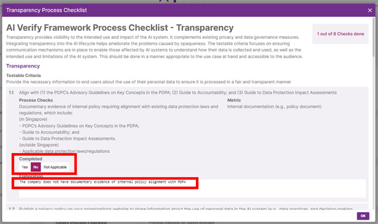
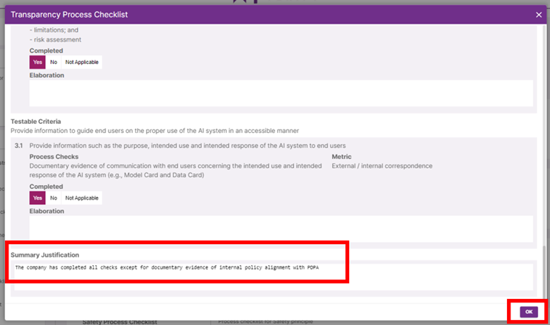
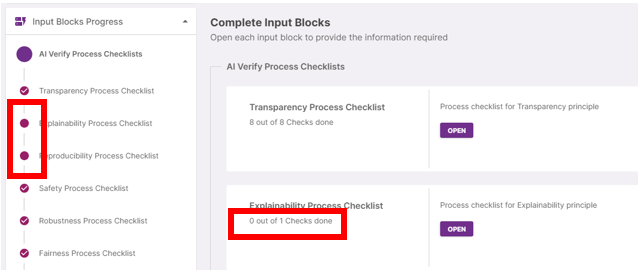

The _AI Verify Summary Report Template for Classification Models_ requires process checklists for all 11 AI ethics principles to be completed:

| AI Ethics Principles                                 | No. of Checks |
| ---------------------------------------------------- | ------------- |
| Transparency                                         | 8             |
| Explainability                                       | 1             |
| Reproducibility                                      | 15            |
| Safety                                               | 9             |
| Robustness                                           | 7             |
| Fairness                                             | 10            |
| Accountability                                       | 8             |
| Human Agency & Oversight                             | 8             |
| Security                                             | 14            |
| Data Governance Process Checklist                    | 4             |
| Inclusve Growth, Societal & Environmental Well-being | 1             |

[Download the testing framework](https://aiverifyfoundation.sg/wp-content/uploads/2023/06/AI-Verify-Testing-Framework-7-June-2023-1.xlsx)

---

Click on **‘Open’**.

Complete each testable criteria by indicating its criterion completion status:

- **Yes:** The criterion is implemented with documentary evidence.
- **No:** The criterion has not been implemented.
- **Not Applicable:** The criterion is not relevant to the use case.

You can provide relevant elaboration as such:

- **If Yes**, describe how the process checks is implemented and/or how the
  evidence has been documented. (where applicable)
- **If No**, state the reason(s) for not implementing the process checks or not documenting evidence.
- **If Not Applicable**, state reason(s)

For each AI ethic principle, you can provide a summarized justification which will be displayed in the Summary Report segment of the report generated like this:

Click on **‘Ok’** once all checks are complete.

Complete the rest of the Process Checklists. You can easily view your input block completion progress in the accordion or within the Input Block for the specific process checklist.

