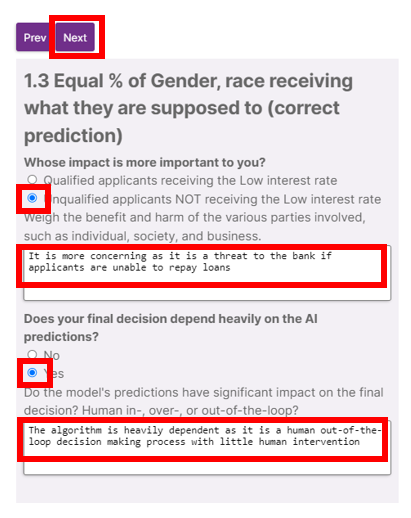

The _AI Verify Summary Report Template for Classification Models_ contains a decision tree component that aids users to select the most appropriate fairness metric for their use case. The Fairness Tree will be contextualised to your AI use case based on the definitions you provide.

Click on **‘Open’**.

Provide the following definitions:

| Definition                                                 | Description                                                                                                                                                | Value |
| ---------------------------------------------------------- | ---------------------------------------------------------------------------------------------------------------------------------------------------------- |-----|
| **(required) Sensitive Feature Name(s)**                   | This is the sensitive feature(s) previously selected in [Step 7.](#7-provide-test-args) Use commas to separate the features (e.g. gender, race)            | gender, race |
| **(required) Favourable Allocated Resource / Opportunity** | This is the resource/ opportunity that is favourable in this use case. (e.g. bail, loan, low interest rate, low insurance premium)                         | low interest rate |
| **(required) Qualified Group**                             | This is the name of the group that is supposed to receive the resource / opportunity. (e.g. non-reoffenders, qualified applicants, licensed companies)     | qualified applicants | 
| **(required) Unqualified Group**                           | This is the name of the group that is NOT supposed to receive the resource / opportunity. (e.g. reoffenders, unqualified applicants, unlicensed companies) | unqualified applicants |

Click **‘Next’** once all fields are filled.

The first level of the fairness tree asks to consider what is fair for your use case. Select all of the desired outcomes applicable. A minimum of 1 and maximum of 3 outcomes can be selected. For each desired outcome selected, there are guiding questions to guide you in documenting the reasons for your selection. 

Click **‘Next’** once completed.

Select the relevant options and document the reasons for the third and final level of the decision tree.

Click **‘Next’** once completed.

With the options selected, the fairness tree has selected the most appropriate fairness metric(s) for your use case. You can scroll to zoom in to further inspect the contextualized decision tree. To reset the metric selection, click on **‘Reset Graph’**.

If you are satisfied with the metric(s) selected, click **‘Ok’**.

