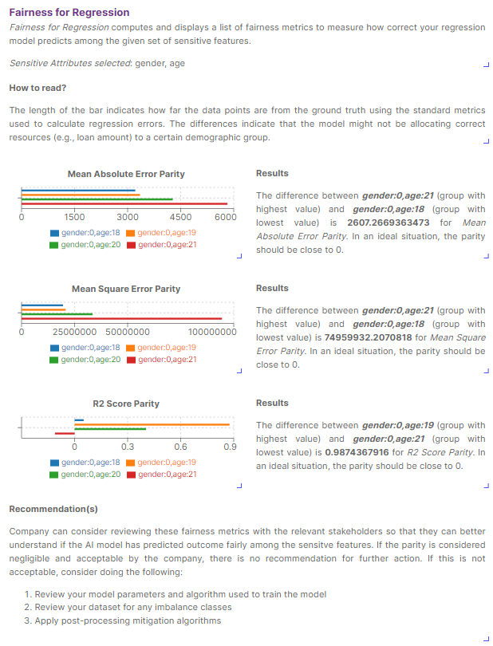

# Fairness Metrics Toolbox for Regression

## Description

This plugin computes and displays a list of fairness metrics to measure how correctly your regression model predicts among the given set of sensitive features.

## Plugin Content
- Algorithms
  
| Name                                    | Description                                                                                                                             |
| --------------------------------------- | --------------------------------------------------------------------------------------------------------------------------------------- |
| Fairness Metrics Toolbox for Regression | The algorithm computes a list of fairness metrics to measure how correct your model predicts among the given set of sensitive features. |

- Widgets

| Name                    | Description                                                                            |
| ----------------------- | -------------------------------------------------------------------------------------- |
| Introduction            | To provide an introduction to the Fairness Metric Toolbox for Regression               |
| Understanding Bar Chart | To guide your users on reading the generated bar chart                                |
| Bar Chart (MAE)         | To generate the bar chart to show the mean absolute error parity between the subgroups |
| Bar Chart (MSE)         | To generate the bar chart to show the mean square error parity between the subgroups   |
| Bar Chart (R2)          | To generate the bar chart to show the r2 score parity between the subgroups            |
| Interpretation (MAE)    | To interpret the mean absolute error parity results                              |
| Interpretation (MSE)    | To interpret the mean square error parity results                                |
| Interpretation (R2)     | To interpret the r2 score parity results                                          |
| Recommendation          | To provide a recommendation for fairness testing for regression models                 |
| Table of Definitions    | To provide a table of definitions                                                      |

## Using the Plugin in AI Verify
### Data Preparation
- Tabular dataset ([Tutorial for Preparation](https://imda-btg.github.io/aiverify/getting-started/prepare-tabular/))

### Algorithm User Input(s)

| Input Field            | Description                                                                                                                            |  Type   |
| ---------------------- | -------------------------------------------------------------------------------------------------------------------------------------- | :-----: |
| Sensitive Feature Name | Array of sensitive features names   You may select multiple sensitive features of interest, and as a guide these are usually demographic features | `array` |

### Sample use of the widgets

