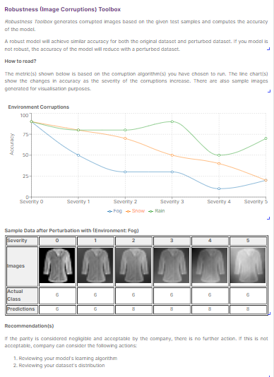

# Image Corruption Toolbox

## Description
This plugin tests the robustness of AI models to natural corruptions. 

There are four different broad groups of corruptions that are packaged in this plugin. Each of these broad groups of corruptions also have more specific corruption functions indicated in brackets below:
- General (Gaussian, Poisson, Salt and Pepper Noise)
- Blur (Defocus, Gaussian, Glass, Horizontal Motion, Vertical Motion, Zoom Blur)
- Digital (Brightness Up and Down, Contrast Up and Down, Compression, Random Tilt, Saturate)
- Environmental (Rain, Fog, Snow)

The toolbox generates corrupted images based on the uploaded test data at 5 different severity levels for each corruption function. The accuracy of the model is calculated with the new corrupted datasets.

## Plugin Content
- Algorithms
  
|          Name           |                                                                                             Description                                                                                             |
| :---------------------: | :-------------------------------------------------------------------------------------------------------------------------------------------------------------------------------------------------: |
|    Blur Corruptions     |     Algorithm that adds blur corruptions (defocus, gaussian, glass, horizontal motion, vertical motion and zoom Blur) to images at 5 severity levels, and calcualtes the accuracy of the model      |
|   Digital Corruptions   | Algorithm that adds digital corruptions (brightness up and down, contrast up and down, compression, random tilt, saturate) to images at 5 severity levels, and calcualtes the accuracy of the model |
| Environment Corruptions |                             Algorithm that adds environmental corruptions (rain, fog and snow) to images at 5 severity levels, and calcualtes the accuracy of the model                             |
|   General Corruptions   |                Algorithm that adds environmental corruptions (gaussian, poisson and salt and pepper noise) to images at 5 severity levels, and calcualtes the accuracy of the model                 |

- Widgets

| Name                                                                                                                                                                                                                                                                                                             | Description                                                                                       |
| ---------------------------------------------------------------------------------------------------------------------------------------------------------------------------------------------------------------------------------------------------------------------------------------------------------------- | ------------------------------------------------------------------------------------------------- |
| Introduction                                                                                                                                                                                                                                                                                                     | To provide an introduction to the Image Corruption Toolbox                                        |
| Understanding Line Chart                                                                                                                                                                                                                                                                                         | To guide your users on reading the generated line charts                                         |
| Line Chart (Blur Corruptions)                                                                                                                                                                                                                                                                                    | To generate line chart to visualise the accuracy results when blur corruptions are applied        |
| <ul> <li> Samples (Blur: Defocus Blur) </li> <li>Samples (Blur: Gaussian Blur) </li> <li>Samples (Blur: Glass Blur) </li> <li> Samples (Blur: Horizontal Motion Blur) </li> <li>Samples (Blur: Vertical Motion Blur) </li> <li>Samples (Blur: Zoom Blur)</li> </ul>                                              | To generate sample images for the blur corruptions                                                |
| Line Chart (Digital Corruptions)                                                                                                                                                                                                                                                                                 | To generate line chart to visualise the accuracy results when digital corruptions are applied     |
| <ul> <li> Samples (Digital:  Brightness Up) </li> <li>Samples (Digital:  Brightness Down) </li> <li>Samples (Digital:  Contrast Up </li> <li> Samples (Digital:  Contrast Down </li> <li>Samples (Digital:  Saturate) </li> <li>Samples (Digital: Compression)</li> <li>Samples (Digital: Compression)</li></ul> | To generate sample images for the digital corruptions                                             |
| Line Chart (Environmental Corruptions)                                                                                                                                                                                                                                                                           | To generate line chart to visualise the accuracy results when environment corruptions are applied |
| <ul><li> Samples (Environment: Rain) </li><li> Samples (Environment: Fog)</li>   <li> Samples (Environment: Snow)</li></ul>                                                                                                                                                                                      | To generate samples for the environment corruptions                                               |
| Line Chart (General Corruptions)                                                                                                                                                                                                                                                                                 | To generate line chart to visualise the accuracy results when general corruptions are applied     |
| <ul><li> Samples (General: Gaussian) </li><li> Samples (General: Poisson)</li>   <li> Samples (General: Salt and Pepper)</li></ul>                                                                                                                                                                               | To generate sample images for the general corruptions                                             |
| Recommendation                                                                                                                                                                                                                                                                                                   | To provide recommendations for robustness (image corruptions) testing |

## Using the Plugin in AI Verify
### Data Preparation
- Image dataset ([Tutorial for Preparation](https://imda-btg.github.io/aiverify/getting-started/prepare-image/#1-dataset-preparation))
- Annotated Ground Truth Dataset ([Tutorial for Preparation](https://imda-btg.github.io/aiverify/getting-started/prepare-image/#2-annotated-ground-truth-dataset))

### Additional Requirements
ImageMagick (Details for installation can be found [here](https://docs.wand-py.org/en/0.6.11/guide/install.html#))

### Algorithm User Input(s)
Note: These inputs are the same for all the algorithms in this plugin (Blur Corruptions, Digital Corruptions, Environmental Corruptions and General Corruptions)
|                Input Field                |                                                                            Description                                                                             |   Type   |
| :---------------------------------------: | :----------------------------------------------------------------------------------------------------------------------------------------------------------------: | :------: |
|        Annotated ground truth path        |                                      An uploaded dataset containing image file names and the corresponding ground truth label                                      | `string` |
| Name of column containing image file name |                                   Key in the name of the column containing the file names in the annotated ground truth dataset                                    | `string` |
|  Seed for selection of data for display   | Some of the plugins selects a random sample data for display. The random seed for this selection can be changed, if desired. The default value we are using is 10. |  `int`   |

### Sample use of the widgets

