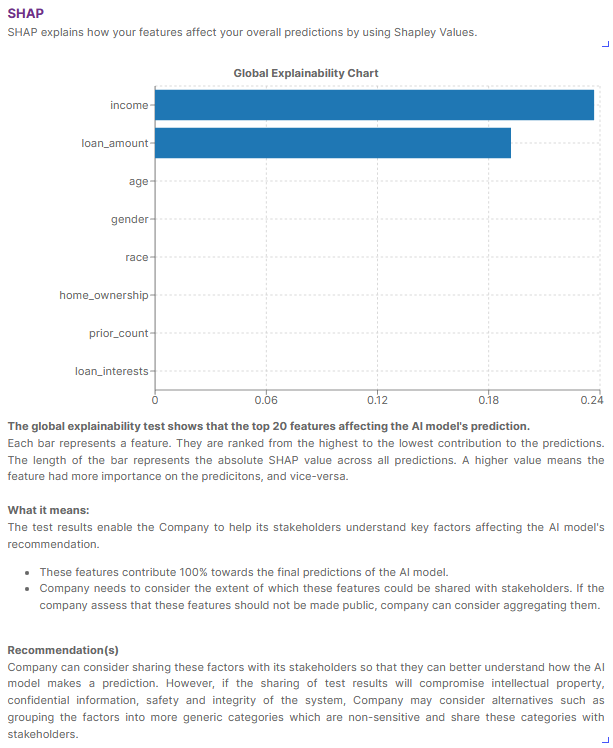

# SHAP Toolbox

## Description
This plugin explains how your features affect your overall predictions by using Shapley Values.

## Plugin Content
- Algorithms
  
| Name               | Description                                                                                      |
| ------------------ | ------------------------------------------------------------------------------------------------ |
| SHAP Toolbox | SHAP (SHapley Additive exPlanations) is a game theoretic approach to explain the output of any machine learning model. |

- Widgets

| Name                    | Description                                                                            |
| ----------------------- | -------------------------------------------------------------------------------------- |
| Introduction            | To provide an introduction to SHAP                                                     |
| Understanding Bar Chart | To guide your users on reading the generated bar chart                                |
| Bar Chart (Summary)     | To generate bar chart, interpretation and recommendations for explainability testing |
| Bar Chart (Technical)   | To display the average SHAP values using a bar chart                                   |
| Recommendations         | To provide a recommendation for explainability testing                                 |

## Using the Plugin in AI Verify
### Data Preparation
- Tabular dataset ([Tutorial for Preparation](https://aiverify-foundation.github.io/aiverify/getting-started/prepare-tabular/))

### Algorithm User Input(s)

| Input Field                 | Description                                                                                                                                |   Type   |
| --------------------------- | ------------------------------------------------------------------------------------------------------------------------------------------ | :------: |
| Type of explainability      | Options: [global (default), local].  Global explainability explains overall dataset. Local explainability explains a random data point. | `string` |
| Path of the background data | Background data path                                                                                                                       | `string` |
| Size of the background      | Background samples (eg. 25)                                                                                                      |  `int`   |
| Size of the test dataset    | Data Samples (eg. 25)                                                                                       | `int` |

### Sample use of the widgets

