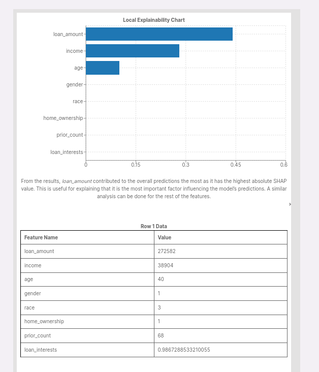

# SHAP Toolbox

## Description
This plugin explains how your features affect your overall prediction for a single row of data by using Shapley Values.

## Plugin Content
- Algorithms
  
| Name               | Description                                                                                      |
| ------------------ | ------------------------------------------------------------------------------------------------ |
| Local SHAP Toolbox | SHAP (SHapley Additive exPlanations) is a game theoretic approach to explain the output of any machine learning model. |

- Widgets

| Name                       | Description                                                                              |
| -------------------------- | ---------------------------------------------------------------------------------------- |
| Local Explainability Chart | To display the SHAP values using a bar chart for the selection row, and display row data |

## Using the Plugin in AI Verify
### Data Preparation
- Tabular dataset ([Tutorial for Preparation](https://imda-btg.github.io/aiverify/getting-started/prepare-tabular/))

### Algorithm User Input(s)

| Input Field                 | Description                                                |   Type   |
| --------------------------- | -----------------------------------------------------------| :------: |
| Row Number                  | Row number of data to perform local explainability test    |  `int`   |
| Path of the background data | Background data path                                       | `string` |
| Size of the background      | Background samples (eg. 25)                                |  `int`   |
| Size of the test dataset    | Data Samples (eg. 25)                                      |  `int`   |

### Sample use of the widgets

